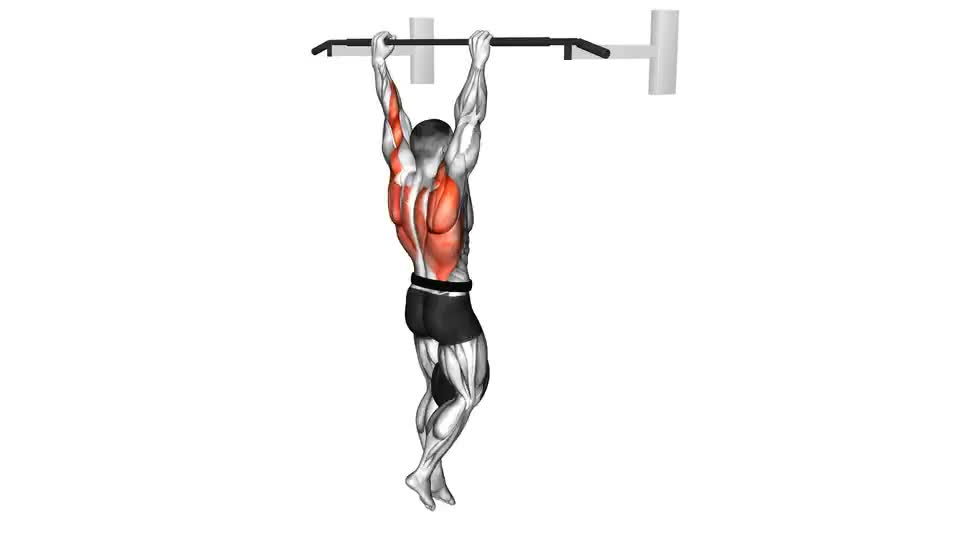

# Back

### **1. Pull-Ups (Weighted or Bodyweight)**

**Muscles:** Lats (Width), Rear Delts, Core

**Sets/Reps:** 4 sets × 8–12 reps

**Tip:**

- Grip: Slightly wider than shoulder width.
- Full stretch at bottom, chest up to bar.
- Control the eccentric (lowering) phase.

> 🔥 Builds wide lats — gives that “V” shape.
> 

### ✅ **How To Do:**

1. Grab the bar with an **overhand grip**, slightly wider than shoulder width.
2. Hang fully stretched — arms straight, chest up, shoulder blades active.
3. Start pulling by **driving elbows down** toward your ribs (not just arms).
4. Bring your **upper chest close to the bar**, and squeeze your lats hard.
5. Slowly lower yourself all the way down until arms are fully extended.

---

### 💡 **What to Remember:**

- Don’t swing — control both **up and down** movement.
- Keep your **core tight** and avoid arching too much.
- Focus on **pulling from your elbows** — not your biceps.
- Get full stretch at the bottom for maximum lat growth.

---

### 🔥 **Pro Tips:**

- If bodyweight feels easy → add a **dip belt** for extra resistance.
- Can’t do full pull-ups yet? Use **assisted pull-up machine** or bands.
- Try **different grips weekly** (wide, neutral, reverse) to hit all lat angles.
- Imagine you’re **“pulling your elbows into your back pockets.”**

---

### **2. Barbell Deadlift**

**Muscles:** Full Back, Traps, Erector Spinae, Glutes

**Sets/Reps:** 4 sets × 5–8 reps (heavy)

**Tip:**

- Bar close to shins, flat back, tight core.
- Pull explosively but controlled.
- Don’t hyperextend at the top.

> 💪 Foundation of power and overall back density.
> 

### ✅ **How To Do:**

1. Stand with **feet shoulder-width**, bar above mid-foot.
2. Bend down, grip bar slightly wider than legs.
3. Keep **chest up, shoulders back, spine neutral**.
4. Take a deep breath, **brace your core**, and tighten lats.
5. Push through your **heels** and lift the bar by extending knees & hips.
6. At top, stand tall but don’t hyperextend.
7. Lower the bar **under control**, keeping it close to your body.

---

### 💡 **What to Remember:**

- Keep bar **close to shins** the whole time.
- **Flat back** = safe and strong lift.
- Don’t jerk the bar — engage tension first.
- Always reset your position before each rep.

---

### 🔥 **Pro Tips:**

- Think of it like a **leg press standing up** — push the ground away.
- Use **mixed grip (one overhand, one underhand)** for heavy sets.
- Use chalk or straps if grip fails before your back.
- Avoid bouncing the bar — focus on full control.

---

### **3. Barbell Bent-Over Rows**

**Muscles:** Lats, Rhomboids, Rear Delts

**Sets/Reps:** 4 sets × 8–10 reps

**Tip:**

- Keep torso at ~45° angle.
- Pull bar to your belly button.
- Squeeze shoulder blades together.

> ⚡ Adds that thick 3D mid-back look.
> 

### **How To Do:**

1. Hold barbell with an **overhand grip** (shoulder-width).
2. Slightly bend knees and hinge forward — torso about **45° angle**.
3. Keep **back straight** and chest up.
4. Pull bar toward your **lower ribs or belly button** using your lats.
5. **Squeeze shoulder blades** together for 1 second.
6. Lower the bar slowly with full control — don’t let it drop.

---

### 💡 **What to Remember:**

- Don’t stand up mid-rep — keep body fixed.
- Elbows should move **close to your sides**, not flared.
- Keep your **core tight** to protect lower back.
- Avoid overusing arms — **lead with elbows**, not biceps.

---

### 🔥 **Pro Tips:**

- Use an **underhand grip** sometimes to hit lower lats.
- If lower back tires fast, try **chest-supported version** (bench-supported).
- Use lifting straps to focus purely on your back instead of grip.
- Control the **eccentric (downward)** phase for better muscle growth.

---

### **4. Lat Pulldown (Front Grip or Neutral Grip)**

**Muscles:** Lats (Width)

**Sets/Reps:** 3–4 sets × 10–12 reps

**Tip:**

- Don’t lean back too much.
- Pull bar to upper chest.
- Focus on pulling with elbows, not hands.

> 🎯 Targets outer lats for width.
> 

### ✅ **How To Do:**

1. Sit down and grip the bar **wider than shoulder width** (or neutral grip for variation).
2. Keep your **chest up** and lean slightly back (10–15° only).
3. Pull the bar down to your **upper chest**, leading with elbows.
4. Squeeze your lats at the bottom for 1–2 seconds.
5. Slowly release to full stretch at the top.

### 💡 **What to Remember:**

- Don’t swing or use momentum.
- Keep your **shoulders down and back** (don’t shrug).
- Pull with elbows, not hands.
- Full stretch = better lat activation.

### 🔥 **Pro Tips:**

- Try **neutral or close grip** every 2–3 weeks for variation.
- Think: “Elbows down to ribs.”
- Keep wrists straight — don’t curl them.

---

## **5. Neutral Grip Lat Pulldown (aka V-Grip Pulldown)**

**🎯 Main Target Muscles:**

- **Lats (Latissimus Dorsi)** – main width muscle
- **Teres Major** – helps give that rounded outer lat look
- **Rhomboids & Mid Traps** – adds back thickness
- **Biceps & Forearms** – assist during the pu

  

### ✅ **How To Do:**

1. Attach a **V-bar** handle to pulldown machine.
2. Sit tall, chest up, arms extended overhead.
3. Pull the handle to your **upper chest**, keeping elbows tight to body.
4. Pause and squeeze your lats.
5. Slowly return to full stretch.

### 💡 **What to Remember:**

- Keep core tight and **don’t lean too far back**.
- Focus on the **stretch and contraction** — not speed.
- Keep elbows pointing **down and slightly back**.

### 🔥 **Pro Tips:**

- Great for finishing lats after wide pulldowns.
- Add a **slow eccentric (3–4 seconds)** for deeper burn.
- Perfect for people who struggle to feel their lats during wide-grip moves.

---

### **6. Reverse Grip Lat Pulldown**

**Muscles:** Lower lats + biceps

**Sets/Reps:** 4 sets × 10–12

**Tip:**

- Underhand grip, shoulder width.
- Pull to upper chest, full stretch on top.

> 🧩 Adds depth to lower lat region (for that cobra tail look).
> 

### ✅ **How To Do:**

1. Grip bar with **underhand grip**, shoulder width.
2. Sit down, chest up, arms straight overhead.
3. Pull bar to **upper chest**, driving elbows down and back.
4. Squeeze your lower lats at bottom.
5. Slowly control bar upward for full stretch.

### 💡 **What to Remember:**

- Don’t let elbows flare out.
- Focus on **lower part of lats** — pull slightly toward sternum.
- Maintain controlled tempo.

### 🔥 **Pro Tips:**

- This is the best move for the **“cobra tail” look** (lower lat thickness).
- You can alternate between **close and shoulder-width grip** every week.

---

### **7. Dumbbell Single-Arm Row**

**Muscles:** Lats, Lower Back, Rear Delts

**Sets/Reps:** 3 sets × 10–12 reps each arm

**Tip:**

- Pull dumbbell toward your hip (not chest).
- Feel the stretch at bottom, squeeze at top.

> 💥 Improves symmetry and lat isolation.
> 

### ✅ **How To Do:**

1. Place one knee and hand on a bench, back flat.
2. Hold dumbbell in opposite hand.
3. Pull the dumbbell **toward your hip**, not your chest.
4. Squeeze lats at top, then lower slowly.

### 💡 **What to Remember:**

- Keep shoulders level — don’t twist torso.
- Focus on **stretch at bottom and squeeze at top.**
- Keep core engaged.

### 🔥 **Pro Tips:**

- Perfect for fixing left–right imbalance.
- Add a small **pause at the top** for more control.
- Go heavier as your form improves — this is a pure mass builder.

---

### **8. Straight-Arm Cable Pullover**

**Muscles:** Lats (Outer and Lower)

**Sets/Reps:** 3 sets × 12–15 reps

**Tip:**

- Keep arms slightly bent.
- Pull down in a smooth arc using lats only.
- Squeeze for 1–2 seconds at bottom.

> 🌊 Excellent finisher for lat width.
> 

### ✅ **How To Do:**

1. Attach straight bar to high pulley.
2. Step back slightly, hinge at hips, arms straight (slightly bent elbows).
3. Pull bar down in a smooth arc toward your thighs.
4. Squeeze lats for 1–2 seconds at bottom, then return slowly.

### 💡 **What to Remember:**

- Don’t bend elbows — keep arms fixed.
- Focus on moving **from shoulder joint**, not arms.
- Maintain tension throughout.

### 🔥 **Pro Tips:**

- Great finisher for a **lat “pump.”**
- Combine with slow breathing: **inhale on way up, exhale pulling down.**
- Try rope attachment for a different feel.

---

### **9. T-Bar Row (with chest support if available)**

**Muscles:** Mid-back, traps, rhomboids

**Sets/Reps:** 4 sets × 10–12 reps

**Tip:**

- Use different grips each week (wide, close, neutral).
- Focus on squeezing shoulder blades.

> 🧱 Gives that “thickness” down the spine and under the traps.
> 

### ✅ **How To Do:**

1. Place chest on pad or lean over T-bar setup.
2. Grab handles (neutral or wide).
3. Pull bar toward your **lower chest or upper abs**.
4. Squeeze shoulder blades together.
5. Lower bar slowly to full stretch.

### 💡 **What to Remember:**

- Keep chest on pad — avoid bouncing.
- Pull smoothly; don’t jerk weight.
- Keep neck neutral.

### 🔥 **Pro Tips:**

- Switch grips weekly (close, neutral, wide) for full back development.
- Great for adding **thickness** down your spine.
- If no chest support, control lower back tension carefully.

---

### **10. Seated Cable Row (Close Grip)**

**Muscles:** Lats, Rhomboids, Lower Back

**Sets/Reps:** 4 sets × 10–12 reps

**Tip:**

> 🎯 Shapes and details your mid-back area.
> 
- Keep chest up, pull to lower abs.
- Squeeze and hold 1 second at contraction.

### ✅ **How To Do:**

1. Sit on machine, grab close grip handle.
2. Keep chest up, arms straight forward.
3. Pull handle to **lower abs**, not chest.
4. Squeeze back for 1 second.
5. Slowly extend arms for full stretch.

### 💡 **What to Remember:**

- Don’t lean too far back.
- Keep movement **controlled and steady**.
- Full stretch = full contraction.

### 🔥 **Pro Tips:**

- Use **drop set** on last set for maximum pump.
- Slight pause at full contraction enhances detail in mid-back.

---

### **11. Dumbbell Shrugs or Face Pulls (Optional Finisher)**

**For Shrugs:** 3 sets × 15 reps (Traps)

**For Face Pulls:** 3 sets × 15 reps (Rear Delts, Rhomboids)

> 💎 Adds upper-back detail and posture improvement.
> 

### ✅ **How To Do Shrugs:**

1. Hold dumbbells by sides.
2. Raise shoulders straight up — no rotation.
3. Hold for 1 second, then lower slowly.

### ✅ **How To Do Face Pulls (Rope Attachment):**

1. Set cable at face level, grab rope.
2. Pull toward your forehead, elbows high.
3. Squeeze rear delts, then slowly return.

### 💡 **What to Remember:**

- Shrugs = up and down only, not circles.
- Face Pull = elbows high, rope apart at face.

### 🔥 **Pro Tips:**

- Great posture corrector.
- Do face pulls at end for shoulder health and upper-back detail.

---

### **12. Meadows Row (Advanced Unilateral Row)**

**Muscles:** Mid-back, lower lats

**Sets/Reps:** 4 sets × 10–12 reps each side

**How:**

- Use a T-bar (landmine setup).
- Grab bar with one hand (palm down), pull toward hip.
- Keep torso low.

> 🔥 Amazing for deep lat contraction and shape.
> 

### ✅ **How To Do:**

1. Set barbell in landmine attachment.
2. Stand sideways to bar, grip end with one hand.
3. Hinge at hips (torso low) and pull bar toward hip.
4. Control down slowly.

### 💡 **What to Remember:**

- Keep back flat, core tight.
- Pull bar along **your body line**, not straight up.

### 🔥 **Pro Tips:**

- Use straps for better grip.
- Perfect for sculpting lower lats and thickness.

---

### **13. Incline Bench Dumbbell Row**

**Muscles:** Mid-back, rhomboids, traps

**Sets/Reps:** 4 sets × 10–12

- Lay chest on an incline bench (~30°).
    
    **How:**
    
- Row dumbbells straight toward ribs.
- Squeeze hard on top.

> 💪 Keeps body stable → isolates mid-back perfectly.
> 

### ✅ **How To Do:**

1. Lay chest on incline bench (~30°).
2. Hold dumbbells below shoulders.
3. Row dumbbells up toward ribs.
4. Squeeze shoulder blades together.
5. Lower dumbbells under control.

### 💡 **What to Remember:**

- Keep chest pressed on bench.
- Don’t swing arms.
- Full stretch at bottom, full squeeze at top.

### 🔥 **Pro Tips:**

- Excellent isolation — no lower back pressure.
- Alternate neutral and overhand grips weekly.

---

### **14. Reverse Pec Deck / Cable Rear Delt Fly**

**Muscles:** Rear delts, traps

**Sets/Reps:** 3 sets × 15–20

**Tip:**

- Focus on slow, controlled reps — no momentum.

> 🎯 Adds definition to upper-back and balances shoulder posture.
> 

### ✅ **How To Do:**

1. Sit facing pec deck (or use cable cross).
2. Grab handles at shoulder height.
3. With slight elbow bend, open arms wide.
4. Squeeze rear delts at full stretch, then return slow.

### 💡 **What to Remember:**

- Focus on **rear delts**, not traps.
- Don’t swing — slow and controlled reps.

### 🔥 **Pro Tips:**

- Go light and slow — higher reps work best here.
- Builds rear delt roundness and improves posture.

---

### **15. Incline Bench Underhand Barbell Row**

**Muscles:** Lower lats + mid-back

**Sets/Reps:** 4 sets × 8–10

**Tip:**

- Set bench to 30°, grip bar underhand.
- Row bar to lower abs.
- Squeeze hard at top.

> 💥 Massive contraction on lower lats and inner back.
> 

### ✅ **How To Do:**

1. Set incline bench (30°), lie chest down.
2. Grip barbell with **underhand grip**.
3. Row bar toward lower abs.
4. Squeeze at top, then lower slowly.

### 💡 **What to Remember:**

- Keep core tight, back neutral.
- Don’t overextend arms at bottom.
- Focus on **lower lats contraction**.

### 🔥 **Pro Tips:**

- One of the best isolation moves for lower back detail.
- Use **slower reps** (2s up, 3s down) for deeper activation.

---