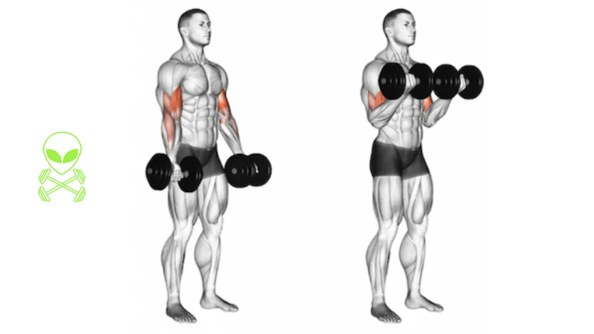

# Byshape

# **1. Standing Dumbbell Bicep Curl (Supinated)**

**Target:** Both heads (Mass builder)

**How to do:**

- Dumbbell pakdo, arms straight
- Curl karo, wrist ko fully supinate karo
- Elbows fixed rakhna (peeche mat le jaana)
- Top pe 1 sec peak contraction
- Slow negative (3 sec)

**Tips:**

✓ Light weight → 100% control

✓ Mind-muscle best hota hai

✓ Don’t swing your back

**Remember:**

❌ Body swing = zero biceps

❌ Elbow travel = cheat rep

**Target:** Long Head + Short Head (Overall mass)

**Level:** Beginner → Intermediate

### **How to Do:**

1. Dumbbells ko neutral grip me pakdo.
2. Arms completely straight, shoulders relaxed.
3. Curl start karte waqt **wrist ko gradually supinate karo** (andar ki taraf ghumaao).
4. Elbows body ke side chipke rakho — hilne nahi dene.
5. Top position pe **1–2 sec hard squeeze**.
6. Down phase ko **3 second slow** control ke saath le jao.

### **Best Tips:**

✓ Weight halka rakho → form 100% perfect banegi.

✓ Dono arms ka arc same rakho.

✓ Mind-muscle → biceps ko imagine karo contracting.

✓ Don’t grip too tight, wrist stiff mat karo.

### **Avoid Mistakes:**

❌ Body ko swing mat karo.

❌ Elbows ko aage mat le jao.

❌ Half reps mat karo — full range always.

### **Remember:**

👉 Supination = biceps peak

👉 Slow negative = maximum growth

### **Ideal Tempo:**

**1 sec up → 2 sec squeeze → 3 sec down**

# **2. Barbell Bicep Curl**

**Target:** Short head + mass + width

**How to do:**

- Shoulder width stance
- Barbell grip slightly wide
- Curl up with controlled motion

**Tips:**

✓ Heavy weight allowed

✓ Use wrist straps if grip slips

✓ Slow negative

**Target:** Short Head + Mass (Width builder)

**Level:** Beginner → Advanced

### **How to Do:**

1. Shoulder-width stance lo.
2. Barbell ko shoulder-width ya wide grip me pakdo.
3. Chest up, core tight.
4. Curl bar ko straight arc me upar lekar jao.
5. Top pe elbow lock mat karo — slight bend.
6. Down phase **slow & controlled**.

### **Tips:**

✓ Heavy use kar sakte ho, par control ke saath.

✓ Bar ko wrist straight rakh kar curl karo.

✓ Keep head neutral (upar mat dekho).

### **Avoid Mistakes:**

❌ Lower back se momentum.

❌ Half reps for ego lifting.

❌ Bar ko nonstop bounce karna.

### **Remember:**

👉 Wide grip = wider biceps

👉 Shoulder stable = maximum pump

### **Tempo:**

**1.5 sec up → 1 sec hold → 3 sec down**

# **3. EZ-Bar Curl (Wide Grip)**

**Target:** Short Head → Biceps Width**

**Level:** Beginner–Intermediate

### **How to Do:**

1. EZ bar ko outward grip se pakdo.
2. Elbows tight and tucked.
3. Curl bar ko chest ke upar tak lao.
4. Top pe tight squeeze.
5. Full stretch at bottom.

### **Tips:**

✓ Wide grip → perfect for wide biceps.

✓ Keep wrists comfortable (EZ bar ergonomic hota hai).

✓ Don’t flare elbows.

### **Mistakes:**

❌ Too heavy = bad form

❌ Leaning back to lift

❌ No bottom stretch

### **Remember:**

👉 Short head ko grow karne ka best beginner-friendly exercise.

### **Tempo:**

**1–2 sec up → 2 sec squeeze → 3 sec down**

# **4. EZ-Bar Close Grip Curl**

**Target:** Long Head → Peak height**

**Level:** Intermediate

### **How to Do:**

1. EZ bar ko narrow grip se pakdo.
2. Elbows ko slightly behind rakho (long head stretch).
3. Curl bar ko upward arc me lao.
4. Top pe hard squeeze with wrist supinated.

### **Tips:**

✓ Narrow grip = long head stretch insane.

✓ Keep chest lifted for extra tension.

### **Avoid:**

❌ Fast reps

❌ Elbow flare

❌ Using back muscles

### **Remember:**

👉 Peak biceps chahiye? Yeh must hai.

### **Tempo:**

**2 sec up → 1 sec squeeze → 3 sec down**

# **5. Incline Dumbbell Curls**

**Target:** Long Head (Peak Builder)

**Level:** Intermediate

### **How to Do:**

1. Bench angle 40–45° pe set karo.
2. Arms ko bilkul niche drop hone do.
3. Start curl with full stretch (deepest stretch exercise).
4. Top pe squeeze but elbows forward mat le jaana.
5. Down phase slow & controlled.

### **Tips:**

✓ Deep stretch = long head explode growth.

✓ Light weight best form deta hai.

✓ Full ROM mandatory.

### **Mistakes:**

❌ Heavy weight = shoulder involvement

❌ Short reps

❌ Curling too fast

### **Remember:**

👉 Yeh peak banane wali #1 exercise hai.

### **Tempo:**

**2 sec up → 1–2 sec hold → 4 sec down (slow stretch)**

# **6. Concentration Curl**

**Target:** Peak, Shape, Isolation

**Level:** Beginner–Intermediate

### **How to Do:**

1. Bench pe baitho.
2. Elbow ko inner thigh ke against rakho.
3. Dumbbell ko slow upward curl karo.
4. Top pe **2–3 sec squeeze**.
5. Down phase fully controlled.

### **Tips:**

✓ Maximum isolation, zero cheating.

✓ Perfect for finishing sets.

✓ Look directly at bicep while curling (mind-muscle boost).

### **Avoid:**

❌ Dropping dumbbell fast

❌ Elbow move karna

❌ Side lean

### **Remember:**

👉 Peak contraction sabse strong yahin milta hai.

### **Tempo:**

**1.5 sec up → 2 sec squeeze → 3 sec down**

# **7. Preacher Curl (Machine)**

**Target:** Short Head (Width + Shape)**

**Level:** Beginner

### **How to Do:**

1. Machine seat adjust karo so elbow pad perfect height par ho.
2. Arms fixed on pad.
3. Curl upwards slowly.
4. Top pe soft squeeze.
5. Downwards full stretch till you feel burn.

### **Tips:**

✓ Machine = strict form, no cheating.

✓ Use moderate weight.

✓ Perfect exercise for beginners to learn control.

### **Avoid:**

❌ Elbows lift mat hone do

❌ Fast negatives

❌ Lockout mat karo

### **Remember:**

👉 Short head grow = width increase = wide biceps look

### **Tempo:**

**2 sec up → 1 sec hold → 3 sec down**

# **8. Preacher Curl (EZ Bar / Barbell)**

**Target:** Short Head + Lower biceps thickness

**Level:** Intermediate

### **How to Do:**

1. Preacher bench par sit karo.
2. EZ bar ko comfortable grip me pakdo.
3. Elbows pad pe stable rakho.
4. Curl slowly, top pe squeeze.
5. Bottom me complete stretch lo.

### **Tips:**

✓ EZ bar wrist friendly hota hai.

✓ Perfect isolated contraction.

✓ Controlled reps = shape improvement.

### **Avoid:**

❌ Bouncing

❌ Lifting elbow

❌ Too heavy weights

### **Tempo:**

**2 sec up → 1.5 sec squeeze → 3 sec down**

# **9. Spider Curl**

**Target:** Long Head + Separation**

**Level:** Intermediate

### **How to Do:**

1. Bench ko 45° par set karo (chest support).
2. Arms ko aage hang hone do.
3. Dumbbells / barbell ko upward curl karo.
4. Top pe **peak squeeze**.
5. Down slow, elbows fixed.

### **Tips:**

✓ Pure isolation, pure tension.

✓ Zero cheating because body support hai.

✓ Great for finishing long head.

### **Avoid:**

❌ Swinging

❌ Rushed reps

❌ Half ROM

### **Remember:**

👉 Yeh exercise “bicep separation” banati hai — bohot aesthetic effect.

### **Tempo:**

**1.5 sec up → 1 sec squeeze → 3–4 sec down**

# **10. Cable Curl (Straight Bar)**

**Target:** Constant tension + Short Head + Pump**

**Level:** Beginner → Advanced

### **How to Do:**

1. Cable machine lowest setting par rakho.
2. Straight bar lagao.
3. Curl with elbows tight.
4. Top contraction me 1 sec hold.
5. Down phase slow & resisted.

### **Tips:**

✓ Cable tension continuous hoti hai — best pump.

✓ Use lighter weight for high reps.

✓ Perfect for end of workout.

### **Avoid:**

❌ Leaning backward

❌ Pulling with shoulders

❌ Fast reps

### **Remember:**

👉 Cables = pump + shape

👉 Perfect finisher

### **Tempo:**

**1 sec up → 1 sec squeeze → 3 sec down**

# **11. Cable Rope Curl**

**Target:** Short Head (Width) + Forearm Engagement

**Level:** Beginner – Intermediate

### **How to Do:**

1. Rope handle ko lowest pulley par attach karo.
2. Rope ko neutral grip me pakdo (thumbs up).
3. Curl karte waqt elbows body ke close rakho.
4. Top position par **rope ko outward pull** karo → short head squeeze.
5. Down phase slow controlled.

### **Tips:**

✓ Rope end ko spread karna = short head peak contraction.

✓ Perfect pump exercise.

✓ Keep torso stable.

### **Avoid Mistakes:**

❌ Leaning back for momentum

❌ Rope ko upar pull karte waqt elbows flare

❌ Fast tempo

### **Remember:**

👉 Short head grow = biceps ki WIDENESS badhti hai.

👉 Rope movement natural hota hai → wrist pain nahi.

### **Tempo:**

**1.5 sec up → 1 sec outward spread → 3 sec down**

# **12. Hammer Curl (Dumbbell)**

**Target:** Brachialis + Biceps Thickness**

**Level:** Beginner – Advanced

### **How to Do:**

1. Dumbbells neutral grip me pakdo.
2. Elbows ko tight rakho.
3. Dumbbell ko straight upward arc me curl karo.
4. Top pe slight squeeze.
5. Down slow.

### **Tips:**

✓ Hammer curls **arm thickness** banane ki #1 exercise hai.

✓ Neutral grip maintain karna important.

✓ Don’t rotate wrist.

### **Mistakes:**

❌ Weight swing

❌ Shoulder se lift

❌ Half reps

### **Remember:**

👉 Brachialis = biceps ko upar push karta hai, making arms look BIGGER.

### **Tempo:**

**1 sec up → 1 sec squeeze → 3 sec down**

# **13. Reverse Curl (Barbell)**

**Target:** Brachialis + Brachioradialis + Upper Forearm**

**Level:** Beginner – Intermediate

### **How to Do:**

1. Overhand grip se barbell pakdo.
2. Elbows tight.
3. Curl barbell ko slow upward.
4. Top pe forearm contraction feel karo.
5. Down stretch fully.

### **Tips:**

✓ Light weight use karo — overhand grip tough hota hai.

✓ Best forearm + biceps thickness builder.

✓ Wrists straight rakhna.

### **Mistakes:**

❌ Heavy weight = wrist pain

❌ Bar drop fast

❌ Elbow flare

### **Remember:**

👉 Reverse curls = overall arm thickness & fullness.

### **Tempo:**

**1–2 sec up → 1 sec squeeze → 3 sec down**

# **14. Zottman Curl**

**Target:** Biceps (supinated) + Forearms (pronated)**

**Level:** Intermediate – Advanced

### **How to Do:**

1. Dumbbells supinated grip me curl karo (normal curl).
2. Top pe wrist ko pronate (palms facing down) karo.
3. Down phase pronated grip me slow.
4. Bottom me wrist supinate back.

### **Tips:**

✓ This is 2-in-1: biceps + forearms.

✓ Use light weight due to rotation.

✓ Excellent control builder.

### **Mistakes:**

❌ Fast rotation

❌ Wrist bent too much

❌ Heavy weight

### **Remember:**

👉 Shape + strength + forearm development — all in one.

### **Tempo:**

**1 sec up → rotate → 3 sec down**

# **15. High Cable Curls (Overhead Cable Curls)**

**Target:** Long Head + Bicep Peak + Definition

**Level:** Intermediate

### **How to Do:**

1. Dono cables ko shoulder height par set karo.
2. Arms ko wide T-pose me stretch karo.
3. Elbows fixed.
4. Curl hands towards your temples.
5. Top me extreme squeeze.

### **Tips:**

✓ This creates insane pump & separation.

✓ Keep shoulders fixed (no movement).

✓ Light weight = better control.

### **Mistakes:**

❌ Elbows up/down move karna

❌ Heavy weight

❌ Fast tempo

### **Remember:**

👉 Aesthetic biceps banane ka #1 shaping exercise.

### **Tempo:**

**1 sec up → 2 sec squeeze → 3 sec down**

# **16. Low Cable Single-Arm Curl**

**Target:** Short Head (Width Builder)

**Level:** Beginner – Intermediate

### **How to Do:**

1. Cable lowest pulley par set karo.
2. One-hand handle pakdo.
3. Curl upward with elbow tight.
4. Top me squeeze.
5. Down slow.

### **Tips:**

✓ Perfect isolation for shape.

✓ Light weight = full ROM.

✓ Keep wrist supinated.

### **Mistakes:**

❌ Body twist

❌ No stretch

❌ Rushing reps

### **Remember:**

👉 Width + clean shape = low cable curls zaroori.

### **Tempo:**

**1 sec up → 1 sec squeeze → 3 sec down**

# **17. Smith Machine Drag Curl**

**Target:** Long Head Peak**

**Level:** Intermediate

### **How to Do:**

1. Smith bar ko lower height pe set karo.
2. Barbell ko drag style me upar le jao (body ke close).
3. Elbows slightly behind rakhkar curl karo.
4. Top me squeeze.
5. Down slow.

### **Tips:**

✓ Smith machine stability deta hai → better peak squeeze.

✓ Mind-muscle next level.

✓ Use moderate weight.

### **Mistakes:**

❌ Leaning backward

❌ Shoulder involvement

❌ Changing bar path

### **Remember:**

👉 Drag curls = Arnold’s favorite peak movement.

### **Tempo:**

**1–2 sec up → 1 sec squeeze → 3 sec down**

# **18. Cable Reverse Curl**

**Target:** Brachialis + Brachioradialis + Forearm Strength**

**Level:** Beginner – Intermediate

### **How to Do:**

1. Straight bar ko cable machine lowest setting pe attach karo.
2. Overhand grip pakdo.
3. Curl upward while keeping elbows tucked.
4. Forearm contraction feel karo.
5. Down slow.

### **Tips:**

✓ Wrist neutral rakho (no bending).

✓ Light weight = best tension.

✓ Great for forearm + arm thickness.

### **Mistakes:**

❌ Fast reps

❌ Shrugging

❌ Elbow flare

### **Remember:**

👉 Reverse curls se arm volume 3D dikhta hai.

### **Tempo:**

**1–2 sec up → 1 sec squeeze → 3 sec down**

# **19. Cable Hammer Curl (Rope Attachment)**

**Target:** Brachialis + Forearms + Thickness

**Level:** Beginner – Intermediate

### **How to Do:**

1. Low pulley par rope attach karo.
2. Rope ko neutral grip me pakdo (thumb up).
3. Curl toward the chest while **keeping elbows tight**.
4. Top pe rope ko slightly spread karo.
5. Down slow and full stretch.

### **Tips:**

✓ Rope + Hammer = Powerful brachialis activation.

✓ Perfect for “thick” arms.

✓ High reps (12–15) best pump deta h.

### **Mistakes:**

❌ Using shoulders

❌ Swinging

❌ No stretch

### **Remember:**

👉 Brachialis is what makes your arms look BIG even when not flexing.

### **Tempo:**

**1 sec up → 1 sec hold → 3 sec down**

# **20. Dumbbell Drag Curl**

**Target:** Long Head + Peak Height

**Level:** Intermediate

### **How to Do:**

1. Dumbbells pakdo neutral or supinated grip me.
2. Barbell drag curl jaisa motion:
    - Dumbbells ko body ke close drag karo upward.
3. Elbows slightly behind remain.
4. Top pe squeeze.
5. Down slow.

### **Tips:**

✓ Don’t swing.

✓ Long head boil hoti hai isse.

✓ Light weight → better pump.

### **Mistakes:**

❌ Leaning back

❌ Not keeping elbows behind

❌ Heavy weights

### **Remember:**

👉 Drag curls = pure peak builders.

### **Tempo:**

**1–2 sec up → 1 sec squeeze → 3 sec slow**