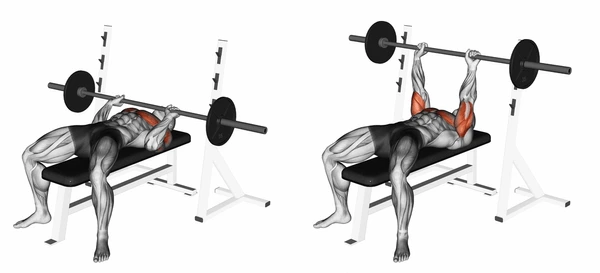

# Chest

## **1. Barbell Bench Press (Flat)**

**Muscle Target:** Middle Chest

**How to Do:**

- Lie flat on a bench, feet on floor.
- Grip the bar slightly wider than shoulder-width.
- Lower the bar slowly to your mid-chest.
- Push it back up till your arms are fully extended.

**Tips:**

- Keep your chest up and shoulder blades squeezed.
- Don’t bounce the bar off your chest.
- Control the movement (2 seconds down, 1 second up).

**Remember:** Focus on muscle contraction, not ego-lifting.

---

## **2. Dumbbell Bench Press**

**Muscle Target:** Middle Chest (better stretch than barbell)

**How to Do:**

- Sit and bring dumbbells to your thighs.
- Lie back and press them up together over your chest.
- Lower slowly till arms are parallel to the floor, then push up.

**Tips:**

- Keep wrists straight, don’t let them bend backward.
- Move in a controlled path — dumbbells allow a deeper stretch.

---

## **3. Incline Barbell Bench Press**

**Muscle Target:** Upper Chest

**How to Do:**

- Set bench at 30–45° incline.
- Grip slightly wider than shoulder-width.
- Lower bar to upper chest (near collarbone), then press up.

**Tips:**

- Don’t go too high incline — 30° is ideal.
- Focus on squeezing your upper chest at top.

---

## **4. Incline Dumbbell Press**

**Muscle Target:** Upper Chest

**How to Do:**

- Same as incline barbell, but with dumbbells for better range.
- Lower dumbbells in a controlled arc, push them back up together.

**Tips:**

- Don’t lock elbows completely.
- Imagine “bringing the dumbbells together” by chest squeeze.

---

## **5. Decline Barbell Bench Press**

**Muscle Target:** Lower Chest

**How to Do:**

- Lie on decline bench, grip bar slightly wide.
- Lower to lower chest area, then push up till arms extended.

**Tips:**

- Keep head neutral.
- Perfect for rounding lower pecs and thickness.

---

## **6. Decline Dumbbell Press**

**Muscle Target:** Lower Chest

**How to Do:**

- Perform same as decline barbell but with dumbbells.
- Control movement for deep stretch.

**Tip:**

- Don’t drop elbows too low — protect shoulder joint.

---

## **7. Chest Dips (Bodyweight or Weighted)**

**Muscle Target:** Lower Chest + Outer Chest

**How to Do:**

- Grip parallel bars, lean slightly forward, elbows flared slightly.
- Lower your body till chest stretch, push back up.

**Tips:**

- Lean forward, don’t stay upright (upright = triceps focus).
- Go slow — don’t bounce.

---

## **8. Push-Ups (Classic)**

**Muscle Target:** Full Chest

**How to Do:**

- Hands shoulder-width, lower chest till it’s near the floor.
- Push up with control.

**Tips:**

- Keep core tight, body straight.
- Go full range of motion.

---

## **9. Incline Push-Ups**

**Muscle Target:** Lower Chest

**How to Do:**

- Hands on bench or box, perform push-up motion.

**Tip:**

- Great finisher for chest burn after heavy presses.

---

## **10. Decline Push-Ups**

**Muscle Target:** Upper Chest

**How to Do:**

- Feet on bench, hands on floor, do push-ups.
- Great for shaping upper pecs.

---

## **11. Cable Crossover (High to Low)**

**Muscle Target:** Lower & Inner Chest

**How to Do:**

- Set pulleys high, take handles, step forward slightly.
- Bring hands downward in front of hips in a hugging motion.

**Tips:**

- Slight bend in elbows.
- Focus on chest squeeze, not arms.

---

## **12. Cable Crossover (Low to High)**

**Muscle Target:** Upper Chest

**How to Do:**

- Set pulleys low, pull upward and inward toward upper chest.

**Tip:**

- Perfect finisher for upper chest activation.

---

## **13. Pec Deck / Machine Fly**

**Muscle Target:** Inner & Middle Chest

**How to Do:**

- Sit on machine, arms bent slightly.
- Bring handles together, squeeze chest hard for 1–2 seconds.

**Tips:**

- Don’t slam weights.
- Keep shoulders down and chest up.

---

## **14. Dumbbell Fly (Flat)**

**Muscle Target:** Inner Chest

**How to Do:**

- Lie flat, dumbbells above chest, arms slightly bent.
- Lower arms out to sides in a wide arc till stretch, bring back up.

**Tips:**

- Don’t go too deep — protect shoulders.
- Focus on chest stretch and squeeze.

---

## **15. Incline Dumbbell Fly**

**Muscle Target:** Upper Inner Chest

**How to Do:**

- Same as flat fly, but on incline bench.

**Tips:**

- Controlled slow movement.
- Squeeze at top for 1–2 seconds.

---

## **16. Machine Chest Press**

**Muscle Target:** Middle Chest

**How to Do:**

- Sit, grip handles, press forward, and control the return.

**Tips:**

- Adjust seat height so handles are mid-chest level.
- Don’t lock elbows.

---

## **17. Smith Machine Bench Press**

**Muscle Target:** Middle & Upper Chest

**How to Do:**

- Set bench flat or incline, press bar in fixed path.

**Tips:**

- Great for controlled negatives (slow lowering).
- Ideal for drop sets and burnout sets.

---

## **18. Squeeze Press (Dumbbell Press Variation)**

**Muscle Target:** Inner Chest

**How to Do:**

- Hold two dumbbells together over your chest and press while squeezing them toward each other the whole time.

**Tips:**

- Keep tension constant.
- Focus on inner chest contraction.

---

## **19. Landmine Press (Single Arm or Both)**

**Muscle Target:** Upper Chest + Shoulders

**How to Do:**

- Set barbell in landmine attachment, hold at chest, press upward in arc.

**Tips:**

- Keep core tight.
- Slight lean forward activates upper chest well.

---

## **20. Guillotine Press (Advanced)**

**Muscle Target:** Upper Chest (Extreme)

**How to Do:**

- Bench flat, barbell lowered to neck/collarbone (not mid-chest).
- Press up carefully.

**Caution:**

- Go light — this exercise can strain shoulders if done wrong.

---

## **21. Single-Arm Dumbbell Bench Press**

**Muscle Target:** Middle Chest + Core Stability

**How to Do:**

- Lie flat on bench with one dumbbell.
- Keep the other hand on your core for balance.
- Lower dumbbell slowly, press back up while keeping your torso stable.

**Tips:**

- Don’t twist — engage your abs.
- Helps fix strength imbalance between sides.

---

## **22. Reverse Grip Bench Press**

**Muscle Target:** Upper Chest (Highly Effective)

**How to Do:**

- Lie on flat bench, hold barbell with reverse (underhand) grip.
- Lower bar slowly to upper chest, push up powerfully.

**Tips:**

- Keep elbows tucked slightly.
- It hits upper chest even more than incline press.
- Use spotter — grip feels awkward at first.

---

## **23. Plate Press (Svend Press)**

**Muscle Target:** Inner Chest

**How to Do:**

- Hold two plates together in front of chest.
- Press them straight out and back while constantly squeezing them together.

**Tips:**

- Perfect for inner chest definition.
- Slow tempo = more burn.

---

## **24. Cable Flat Press**

**Muscle Target:** Middle Chest

**How to Do:**

- Set cables at shoulder height.
- Step forward and press both handles straight ahead like a bench press.

**Tips:**

- Constant tension throughout.
- Great machine-free alternative to chest press.

---

## **25. Standing Cable Chest Fly (Mid-Level)**

**Muscle Target:** Middle Chest + Inner Definition

**How to Do:**

- Set cables at mid-level.
- Step forward, bring both handles together in front of your chest, squeeze, and return slowly.

**Tips:**

- Slight bend in elbows.
- Great finisher for chest definition.