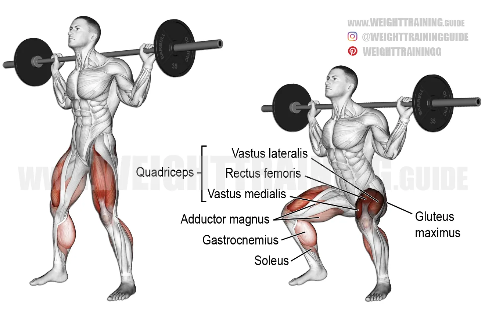

# Leg

# **1. Barbell Back Squat**

**Target:** Quads + Glutes + Hamstrings

**Level:** Beginner → Advanced

### **How to Do:**

1. Bar ko upper traps pe rakho (not neck).
2. Feet shoulder-width, toes slightly outward.
3. Chest up, core tight.
4. Hips push back & sit down like a chair.
5. Thighs parallel or below parallel tak jao.
6. Heels se push karte hue upar aao.

### **Tips:**

✓ Depth = more quad + glute activation.

✓ Heels mat uthne do.

✓ Brace your core before every rep.

### **Avoid Mistakes:**

❌ Knees inward collapse

❌ Rounding lower back

❌ Looking too far up/down

### **Remember:**

👉 Squat is KING. Mass builder #1.

### **Tempo:**

**2 sec down → 1 sec hold → 1 sec up**

# **2. Leg Press (45° Leg Press Machine)**

**Target:** Quads + Glutes**

**Level:** Beginner → Intermediate

### **How to Do:**

1. Feet 1.5 shoulder width, mid-board position.
2. Lower carriage until knees 90–120° bend.
3. Push smoothly without locking knees.
4. Down slow, up powerful.

### **Tips:**

✓ Higher foot position = more glutes

✓ Lower foot position = more quads

✓ Don’t ego lift.

### **Mistakes:**

❌ Too shallow ROM

❌ Locking knees

❌ Lower back lifting from pad

### **Tempo:**

**2 sec down → 1 sec stretch → 1.5 sec up**

# **3. Walking Lunges**

**Target:** Glutes + Hamstrings + Quads

**Level:** Beginner – Advanced

### **How to Do:**

1. Dumbbells pakdo or bodyweight.
2. Big step forward lo.
3. Back knee ground ke near bring.
4. Heel se push karke next step.
5. Maintain steady breathing.

### **Tips:**

✓ Slight forward lean → more glutes

✓ Long steps → hamstrings

✓ Short steps → quads

### **Mistakes:**

❌ Knees passing toes too much

❌ Small steps = unstable

❌ Torso bending sideways

### **Tempo:**

**1 sec step → 2 sec down → 1 sec up**

# **4. Leg Extension Machine**

**Target:** Quads (Vastus Medialis + Rectus Femoris)**

**Level:** Beginner

### **How to Do:**

1. Machine height adjust karo so knee rotation point align ho.
2. Legs fully extend karo with control.
3. Top pe **1–2 sec squeeze**.
4. Down slow for maximum tension.

### **Tips:**

✓ Toe slightly outwards → outer quad

✓ Toe slightly inward → inner quad

✓ High reps = best pump

### **Mistakes:**

❌ Swinging

❌ Locking knees

❌ Not controlling negative

### **Tempo:**

**1 sec up → 2 sec squeeze → 3 sec down**

# **5. Hamstring Curl Machine (Lying)**

### **How to Do:**

1. Machine me leg pad ankle ke upar rakho.
2. Heels ko glutes ki taraf curl karo.
3. Top me squeeze.
4. Down slow stretch.

### **Tips:**

✓ Keep hips down

✓ Keep toes pointed downwards

✓ Slow controlled reps

### **Mistakes:**

❌ Butt raise

❌ Fast reps

❌ Half curl reps

### **Remember:**

👉 Strong hamstrings = knee protection + bigger legs.

### **Tempo:**

**1.5 sec curl up → 1 sec squeeze → 3 sec down**

# **6. Goblet Squat**

**Target:** Quads + Core Stability

**Level:** Beginner

### **How to Do:**

1. Dumbbell ko chest ke near hold karo.
2. Sit deep (ATG recommended).
3. Heels down, torso upright.
4. Up push with quad force.

### **Tips:**

✓ Beginner squat correction ke liye best.

✓ Form perfect karta hai.

✓ Knees outward rakho.

### **Mistakes:**

❌ Back rounding

❌ Narrow stance

❌ Rushing reps

### **Tempo:**

**2 sec down → 1 sec pause → 1 sec up**

# **7. Bulgarian Split Squat**

**Target:** Glutes + Quads (Unilateral King)**

**Level:** Intermediate

### **How to Do:**

1. Rear leg bench pe rakhna.
2. Front leg forward long stance me.
3. Down deep until glute stretch.
4. Up drive through front heel.

### **Tips:**

✓ Best for glute + quad isolation.

✓ Keep torso slightly forward for glutes.

✓ Start with no weight.

### **Mistakes:**

❌ Over-leaning

❌ Short stride

❌ Using back leg too much

### **Tempo:**

**2–3 sec down → 1 sec up**

# **8. Calf Raise (Standing Machine)**

**Target:** Gastrocnemius (Upper Calf)**

**Level:** Beginner

### **How to Do:**

1. Toes straight, heels drop deep.
2. Full upward calf squeeze.
3. Down full stretch.0

### **Tips:**

✓ Full ROM = big calves

✓ Use pause at bottom

### **Mistakes:**

❌ Half reps

❌ Bouncing

❌ Leaning too far forward

### **Tempo:**

**1 sec up → 1 sec squeeze → 2 sec down**

# **9. Seated Calf Raise**

**Target:** Soleus (Lower Calf Thickness)

**Level:** Beginner

### **How to Do:**

1. Knee pad adjust karo.
2. Heels drop full.
3. Up full squeeze.

### **Tips:**

✓ High reps (15–20) best.

✓ Constant tension maintain.

### **Mistakes:**

❌ Bouncing

❌ No stretch

❌ Leaning back

### **Tempo:**

**1 sec up → 2 sec squeeze → 3 sec down**

# **10. Hip Thrust (Barbell)**

**Target:** Glutes (Major Power + Size)**

**Level:** Intermediate – Advanced

### **How to Do:**

1. Upper back bench pe rakho.
2. Barbell hip crease par rakho.
3. Heels ground par tight.
4. Hips upward thrust karo.
5. Top me **glutes squeeze** for 1–2 sec.
6. Down control.

### **Tips:**

✓ Feet slightly wider = more glute

✓ Chin tucked

✓ Full lockout with squeeze

### **Mistakes:**

❌ Over-arching lower back

❌ Short reps

❌ Using quads only

### **Remember:**

👉 Glutes = strongest muscle.

👉 Great for posture & leg shape.

### **Tempo:**

**1 sec up → 2 sec squeeze → 3 sec down**

# **11. Sumo Squat (Dumbbell / Barbell)**

**Target:** Inner Thighs + Glutes**

**Level:** Beginner – Intermediate

### **How to Do:**

1. Feet wide stance, toes outward 30–45°.
2. Chest upright.
3. Dumbbell ko center me hold karo.
4. Down until thighs parallel.
5. Push upward through heels.

### **Tips:**

✓ Toes outward = inner thigh activation

✓ Perfect for hip shape

✓ Keep knees tracking toes

### **Mistakes:**

❌ Knees cave in

❌ Rounding lower back

❌ Very shallow squats

### **Remember:**

👉 Inner thigh definition ka king.

### **Tempo:**

**2 sec down → 1 sec hold → 2 sec up**

# **12. Standing Calf Raise**

**Target:** Gastrocnemius (Upper Calf)**

**Level:** Beginner

### **How to Do:**

1. Step platform par stand karo.
2. Heel ko deep stretch tak niche le jao.
3. Full height tak calf raise karo.
4. Top me squeeze 1 sec.

### **Tips:**

✓ Slow stretch → max growth.

✓ High reps (15–20) karein.

✓ Don’t bounce.

### **Mistakes:**

❌ Fast reps

❌ Half stretch

❌ Leaning forward

### **Remember:**

👉 Calves recover fast → heavy volume needed.

### **Tempo:**

**2 sec up → 1 sec squeeze → 3 sec stretch down**

# **13. Hack Squat (Machine)**

**Target:** Quads (Lower Quad Thickness)

**Level:** Beginner → Advanced

### **How to Do:**

1. Feet shoulder width, slightly forward place karo.
2. Descend until your hips drop below knee level.
3. Push upward **heel drive** se.
4. Full controlled lockout.

### **Tips:**

✓ Toes slightly outward = knee safety

✓ Deep reps = massive quad growth

✓ Control weight, don’t bounce

### **Mistakes:**

❌ Half reps

❌ Knees collapsing inward

❌ Heavy ego lifting

### **Remember:**

👉 Hack squat = quad exploding machine.

### **Tempo:**

**3 sec down → 1 sec pause → 2 sec up**