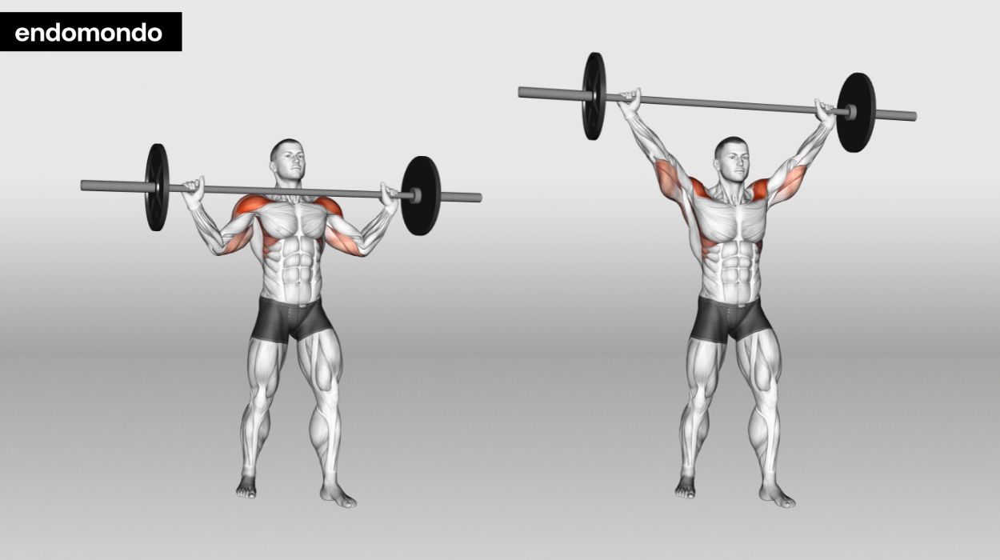

# Shoulder

# 1. FRONT DELT (Front Shoulder) EXERCISES

### 1. Barbell Overhead Press

- **Muscles Worked:** Front + Side delts, triceps, upper chest
- **How To Do:**
    1. Stand straight, feet shoulder-width apart.
    2. Hold the barbell just above your chest.
    3. Press the bar straight overhead until arms are fully extended.
    4. Slowly lower it down to chin level.
- **Tips:**
    - Keep your core tight and glutes engaged.
    - Don’t arch your back too much (common mistake).
    - Use full range of motion for maximum growth.
- **Remember:** Inhale down, exhale up. Go slow on the way down — that’s where growth happens.
- **Trainer Tip:** This is your *king* movement — do it early in your workout.

**Primary Target:** Front & Side Deltoids

**Secondary:** Triceps, Upper Chest, Core

### ➤ How To Perform:

1. Set the barbell on a rack at chest height.
2. Grip the bar slightly wider than shoulder width, palms facing forward.
3. Step back, stand tall with feet shoulder-width apart.
4. Tighten your core, squeeze your glutes, and press the bar overhead in a straight line.
5. Lower the bar slowly back to your upper chest level — don’t bounce.

### ➤ Breathing:

- **Inhale** as you lower the bar.
- **Exhale** while pressing up powerfully.

### ➤ Common Mistakes:

❌ Arching the lower back (puts pressure on spine)

❌ Using leg momentum instead of shoulder power

❌ Lowering bar behind the head (should always go in front of face)

### ➤ Pro Trainer Tips:

✅ Keep the bar path straight — imagine pressing “through your head.”

✅ Don’t rush — control the downward phase (this builds real muscle).

✅ Do this as your first shoulder exercise; it’s the best compound builder.

### ➤ Remember:

- Warm up your rotator cuff before this.
- Keep glutes squeezed — it prevents back arch.
- Go for 4 sets of 6–10 reps for strength and mass.

### 2. Dumbbell Shoulder Press

- **Muscles Worked:** Front & side delts equally
- **How To Do:** Sit upright, dumbbells at shoulder height, palms facing forward, press overhead.
- **Tips:**
    - Keep dumbbells slightly angled (not straight out).
    - Move smoothly, don’t bang dumbbells at top.
    - Avoid leaning too far back.
- **Remember:** Perform seated version to reduce cheating.
- **Pro Variation:** Try *neutral grip (palms facing each other)* — it’s shoulder-friendly.

**Primary Target:** Front Delts

**Secondary:** Side Delts, Triceps

### ➤ How To Perform:

1. Sit on a bench with back support, dumbbells in each hand at ear level.
2. Palms facing forward, elbows under wrists.
3. Press both dumbbells overhead till arms almost straight (don’t lock).
4. Slowly lower to starting position.

### ➤ Breathing:

- **Inhale** down, **exhale** up.

### ➤ Common Mistakes:

❌ Flaring elbows too wide (should stay slightly forward)

❌ Using heavy weight and half range of motion

❌ Slamming dumbbells together on top

### ➤ Pro Trainer Tips:

✅ Seated version isolates shoulders better than standing.

✅ Focus on slow lowering — that’s where delts grow.

✅ Keep dumbbells slightly angled inward — joint-safe position.

### ➤ Remember:

- Keep head neutral (don’t push forward).
- 3–4 sets of 10–12 reps for controlled growth.

### 3. Arnold Press

- **Invented by:** Arnold Schwarzenegger 🦾
- **How To Do:**
    1. Start with palms facing toward your body.
    2. Rotate wrists outward as you press up.
    3. Reverse the motion on the way down.
- **Tips:**
    - This hits all 3 shoulder heads.
    - Move slowly, control rotation.
- **Remember:** Use moderate weights — rotation requires control.
- **Bonus:** Great for full shoulder roundness.

**Target:** All 3 Shoulder Heads (Front, Side, Rear)

### ➤ How To Perform:

1. Sit upright with dumbbells at chest level, palms facing toward you.
2. As you press upward, rotate wrists so palms face forward at top.
3. Lower slowly while rotating back to start position.

### ➤ Breathing:

- **Inhale** down, **exhale** as you rotate and press.

### ➤ Common Mistakes:

❌ Moving too fast (you lose control during rotation)

❌ Using too heavy dumbbells

❌ Arching lower back during press

### ➤ Pro Trainer Tips:

✅ Focus on smooth wrist rotation.

✅ Keep movement continuous — never drop arms completely down.

✅ Mind-muscle connection is key here.

### ➤ Remember:

- Excellent for shaping the “roundness” of delts.
- Perform 3–4 sets of 10–12 reps.

### 4. Front Plate Raise

- **How To Do:** Hold a plate with both hands, lift to shoulder height, and slowly lower.
- **Tips:**
    - Keep arms slightly bent.
    - Don’t swing your body.
- **Remember:** Time under tension matters — 2 seconds up, 3 seconds down.
- **Trainer Note:** Excellent for shoulder definition

**Target:** Front Delts

### ➤ How To Perform:

1. Hold a weight plate at 3 & 9 o’clock grip position.
2. With straight arms, lift to eye level.
3. Lower slowly (3 seconds down).

### ➤ Breathing:

- **Exhale** while lifting, **inhale** while lowering.

### ➤ Common Mistakes:

❌ Swinging the body for momentum

❌ Going above head level (increases trap involvement)

### ➤ Pro Trainer Tips:

✅ Slight bend in elbows — protects joints.

✅ Keep constant tension; don’t rest at bottom.

✅ Add a slow pause at the top (1 second).

### ➤ Remember:

- Great as a finisher or warm-up.
- 3 sets of 12–15 reps.

### 5. Barbell Front Raise

- **How to do**: Hold barbell in front, raise till shoulder height.
- **Tips**: Keep body still.
- **Remember**: Light weight, high reps (12–15).

**Target:** Front Delts

### ➤ How To Perform:

1. Hold a weight plate at 3 & 9 o’clock grip position.
2. With straight arms, lift to eye level.
3. Lower slowly (3 seconds down).

### ➤ Breathing:

- **Exhale** while lifting, **inhale** while lowering.

### ➤ Common Mistakes:

❌ Swinging the body for momentum

❌ Going above head level (increases trap involvement)

### ➤ Pro Trainer Tips:

✅ Slight bend in elbows — protects joints.

✅ Keep constant tension; don’t rest at bottom.

✅ Add a slow pause at the top (1 second).

### ➤ Remember:

- Great as a finisher or warm-up.
- 3 sets of 12–15 reps.

**Target:** Front Delts (emphasizes symmetry)

### ➤ How To Perform:

1. Hold barbell in front of thighs, palms down.
2. Raise till shoulder height.
3. Lower slowly without resting bar on thighs.

### ➤ Tips:

✅ Keep body upright — don’t lean back.

✅ Elbows slightly bent.

### ➤ Remember:

- Use light weight — focus on control.
- 3x12–15 reps.

### 6. Dumbbell Front Raise (Alternating)

- **How to do**: One arm at a time.
- **Tips**: Helps with mind-muscle connection.
- **Remember**: Don’t use momentum.

**Target:** Front Delts

### ➤ How To Perform:

1. Hold dumbbells at sides.
2. Raise one arm at a time to shoulder level.
3. Lower under control.

### ➤ Common Mistakes:

❌ Raising too high (activates traps).

❌ Swinging the torso.

### ➤ Tips:

✅ Alternate arms for better concentration.

✅ Slow negatives = best muscle fiber engagement.

### ➤ Remember:

- Breathe out as you raise.
- Perfect for symmetry.

### 7. Cable Front Raise

- **How to do**: Use low pulley, attach straight bar or rope, raise to shoulder height.
- **Tips**: Constant tension.
- **Remember**: Don’t rush reps.

**Target:** Front Delts

**Advantage:** Constant tension throughout movement

### ➤ How To Perform:

1. Attach straight bar or rope to low pulley.
2. Stand back, hold with both hands.
3. Raise bar to shoulder height, pause, lower slowly.

### ➤ Tips:

✅ Slight forward lean for balance.

✅ Keep elbows slightly bent.

### ➤ Remember:

- Cable gives continuous tension (better than free weights).
- Do 3 sets of 12–15 reps.

## **8. Landmine Press**

**Target:** Front & Upper Chest (joint-safe press option)

### ➤ How To Perform:

1. Anchor one end of barbell in landmine base or corner.
2. Hold the free end at shoulder height, press forward-up.
3. Slowly bring back to shoulder.

### ➤ Tips:

✅ Keep torso slightly leaned forward.

✅ Don’t overextend elbow.

✅ Use for joint-friendly pressing.

### ➤ Remember:

- Great alternative to overhead press if you have shoulder tightness.
- 3 sets of 10 reps each arm.

## **9. Push Press**

**Target:** Front Delts (power movement)

### ➤ How To Perform:

1. Stand with barbell at shoulder height.
2. Slightly bend knees and drive bar overhead using legs & shoulders.
3. Lower under control.

### ➤ Tips:

✅ Keep reps explosive but smooth.

✅ Engage core to avoid back bending.

### ➤ Remember:

- Use moderate weight, focus on power.
- 3–4 sets of 6–8 reps.

## **10. Barbell Z Press**

**Target:** Front + Core

**How To Do:** Sit on floor legs straight, press barbell overhead.

**Tips:** Builds stability and shoulder control.

**Remember:** Keep spine tall and bar path vertical.

## **11. Machine Shoulder Press**

**How To Do:** Sit in machine, handles at shoulder height, press overhead.

**Tips:** Great for isolation and beginner safety.

**Remember:** Don’t bounce off seat; full control each rep.

## **12. Incline Bench Front Raise**

**How To Do:** Lie chest-down on incline bench, raise dumbbells forward.

**Tips:** Prevents cheating.

**Remember:** Excellent isolation for front head.

## 13. Dumbbell Lateral Raise (Strict)

**Primary target:** Lateral deltoid

**How to perform (step-by-step):**

1. Stand tall, feet hip-width, slight bend in knees. Hold dumbbells at sides with neutral grip.
2. Hinge slightly at hips (small forward lean ~10°) to protect joints.
3. With a very slight bend in the elbow, raise the weights out to the side to shoulder height — lead with your elbow, not your hand.
4. Pause for 0.5–1s at the top, then lower slowly (3 seconds).
    
    **Breathing:** Exhale during the lift, inhale on the descent.
    
    **Common mistakes:**
    
- Using momentum (swinging torso)
- Lifting too high (shrugging traps)
- Locking elbow straight
    
    **Pro tips:**
    
- Imagine moving the elbow in a slightly diagonal path (20° forward of pure lateral) to better hit the lateral head.
- Use lighter weight and focus on the top contraction — often 12–15 strict reps.
    
    **Remember:** 3–5 sets of 12–15; tempo 1-0-3 (up-pause-down).
    
    ## 14. Cable Lateral Raise (Single-Arm)
    
    
    
    **Primary target:** Lateral deltoid with constant tension
    
    **How to perform:**
    
    1. Set the cable at the lowest setting with a single handle. Stand side-on to the machine, handle in outside hand.
    2. Keep chest tall; slightly lean toward the machine. With elbow slightly bent, raise arm laterally to shoulder height.
    3. Control back down — cable keeps tension even at the bottom.
        
        **Breathing:** Exhale while lifting.
        
        **Common mistakes:**
        
    - Letting shoulder rotate or shrug at top
    - Reaching forward with the hand instead of lifting the elbow
        
        **Pro tips:**
        
    - Pause 1s at top and focus on squeezing the lateral head.
    - Use cable for higher rep finishers or unilateral correction.
        
        **Remember:** 3–4 sets of 10–15 per side.
        
        ## 15. Leaning Cable Lateral Raise
        
        
        
        **Primary target:** Lateral delts with extended ROM
        
        **How to perform:**
        
        1. Hold a cable with the hand farthest from the machine. Step away and lean away from the tower (support with free hand).
        2. From the hanging position, raise the arm laterally to shoulder level.
        3. Lower under control while keeping the lean.
            
            **Breathing:** Exhale up, inhale down.
            
            **Common mistakes:**
            
        - Leaning too much and losing position
        - Pulling with traps instead of lateral delts
            
            **Pro tips:**
            
        - The lean increases stretch at bottom — use slightly lighter weight than dumbbell raises.
        - Great for finishing sets or weak-side focus.
            
            **Remember:** 3 sets of 12–15 per side.
            
            ## 16. Upright Row (Barbell) — Narrow-to-Moderate Grip
            
            
            
            **Primary target:** Lateral delts & traps (use moderate grip to reduce impingement)
            
            **How to perform:**
            
            1. Grip the barbell with hands shoulder-width or slightly narrower.
            2. Pull the bar close to the body up toward the upper chest, elbows lead and flare out.
            3. Lower under control.
                
                **Breathing:** Exhale while pulling.
                
                **Common mistakes:**
                
            - Using very narrow grip (increases impingement risk)
            - Lifting too high behind the head — keep bar to chest/upper chest level only
                
                **Pro tips:**
                
            - Use this as a compound movement to build lateral width and trap thickness.
            - Stop pull when elbows reach shoulder line to protect shoulder impingement.
                
                **Remember:** 3–4 sets of 8–12; use controlled tempo.
                
                ## 17. Cable Upright Row (Low Pulley + Straight Bar)
                
                
                
                **Primary target:** Lateral delts with smooth tension curve
                
                **How to perform:**
                
                1. Attach small straight bar to low pulley. Stand over it and grasp with both hands.
                2. Pull vertically keeping the bar close to your body until hands near upper chest. Elbows lead.
                3. Return slowly.
                    
                    **Breathing:** Exhale on concentric.
                    
                    **Common mistakes:**
                    
                - Jerking the weight; using excessive torso momentum
                - Raising bar too high — keep elbows roughly in line with shoulders
                    
                    **Pro tips:**
                    
                - Cable version keeps tension continuous and reduces barbell wobble.
                - Great for supersetting with lateral raises for fatigue.
                    
                    **Remember:** 3 sets of 10–12; maintain strict form.
                    
                    ## 18. Incline-Supported Dumbbell Lateral Raise
                    
                    
                    
                    **Primary target:** Lateral delts while eliminating torso cheat
                    
                    **How to perform:**
                    
                    1. Set bench at 10–20° incline and lie on your side or sit sideways with chest supported.
                    2. Raise the dumbbell laterally to shoulder height while chest stays on pad.
                    3. Lower slowly.
                        
                        **Breathing:** Exhale up.
                        
                        **Common mistakes:**
                        
                    - Not using bench support properly (still allows cheating)
                        
                        **Pro tips:**
                        
                    - Removing torso movement makes this extremely strict — you’ll feel the lateral head immediately.
                    - Use moderate weight.
                        
                        **Remember:** 3 sets of 10–15 per side.
                        
                        ## **19. Rear Delt Dumbbell Fly (Bent-Over)**
                        
                        
                        
                        **Primary Target:** Rear delts
                        
                        **Secondary:** Upper back, rotator cuff
                        
                        ### **How to Perform:**
                        
                        1. Stand with feet shoulder-width.
                        2. Hinge at the hips until torso is almost parallel to the floor (~70–90°).
                        3. Hold dumbbells underneath your chest, palms facing each other.
                        4. With a slight bend in elbows, raise arms outward like “opening wings.”
                        5. Pause at top for 1 second.
                        6. Lower slowly for 3 seconds.
                        
                        ### **Breathing:**
                        
                        - Inhale as you lower the weights.
                        - Exhale while raising.
                        
                        ### **Common Mistakes:**
                        
                        ❌ Swinging torso
                        
                        ❌ Using traps (shrugging shoulders)
                        
                        ❌ Dropping arms too fast
                        
                        ❌ Rounding the back (dangerous)
                        
                        ### **Trainer Pro Tips:**
                        
                        ✔ Keep elbows in line with shoulders — NOT behind the body
                        
                        ✔ Think “rear delt squeezing back,” not “lifting the weight”
                        
                        ✔ Keep head neutral (don’t look up)
                        
                        ### **Remember:**
                        
                        - Use light–moderate weights
                        - Strict form gives best activation
                        - 3–4 sets of 12–15 reps
                    
                    ## **20. Cable Rear Delt Fly (High Crossover)**
                    
                    
                    
                    **Primary Target:** Rear delts with constant tension
                    
                    ### **How to Perform:**
                    
                    1. Set both cable pulleys to shoulder height or slightly above.
                    2. Cross hands (left holds right cable, right holds left cable).
                    3. Pull arms outward in a “reverse fly” motion.
                    4. Pause briefly, return under control.
                    
                    ### **Breathing:**
                    
                    - Exhale on the pull.
                    
                    ### **Common Mistakes:**
                    
                    ❌ Bending elbows too much
                    
                    ❌ Pulling too far behind the body
                    
                    ❌ Using traps instead of delts
                    
                    ### **Trainer Pro Tips:**
                    
                    ✔ Keep elbows slightly higher than hands
                    
                    ✔ Think “pull with rear shoulder, not arms”
                    
                    ✔ Use cables for burnout sets — best constant tension
                    
                    ### **Remember:**
                    
                    - Ideal for shaping and definition
                    - 3–4 sets of 15–20 reps
                    
                    ## **21. Face Pull (Rope Attachment)**
                    
                    
                    
                    **Primary Target:** Rear delts + rotator cuff
                    
                    **Secondary:** Upper back, external rotators
                    
                    ### **How to Perform:**
                    
                    1. Set rope cable at upper-chest or face height.
                    2. Pull the rope toward your face.
                    3. Lead with elbows — they should flare outward.
                    4. At the end, rotate wrists so knuckles point behind you.
                    5. Return slowly.
                    
                    ### **Breathing:**
                    
                    - Exhale while pulling.
                    
                    ### **Common Mistakes:**
                    
                    ❌ Pulling too low
                    
                    ❌ Using biceps instead of delts
                    
                    ❌ Keeping elbows tucked (wrong)
                    
                    ### **Trainer Pro Tips:**
                    
                    ✔ Imagine “ripping the rope apart”
                    
                    ✔ Keep spine neutral
                    
                    ✔ Use lighter weight and perfect form
                    
                    ### **Remember:**
                    
                    - Essential for shoulder health
                    - Do at least 3 sets weekly
                    - 12–15 reps
                    
                    ## **22. Cable Rear Delt Pull (One-Arm)**
                    
                    
                    
                    **Primary Target:** Rear delt isolation
                    
                    **How to Perform:**
                    
                    1. Stand sideways to cable.
                    2. Pull handle outward behind you.
                    3. Focus on shoulder movement, not elbow.
                    
                    ### **Breathing:**
                    
                    - Exhale pulling.
                    
                    ### **Common Mistakes:**
                    
                    ❌ Rotating torso
                    
                    ❌ Pulling too far back
                    
                    ### **Pro Tips:**
                    
                    ✔ Excellent for mind-muscle connection
                    
                    ✔ Ultra-clean isolated motion
                    
                    ### **Remember:**
                    
                    3 sets of 12–20 reps per arm.