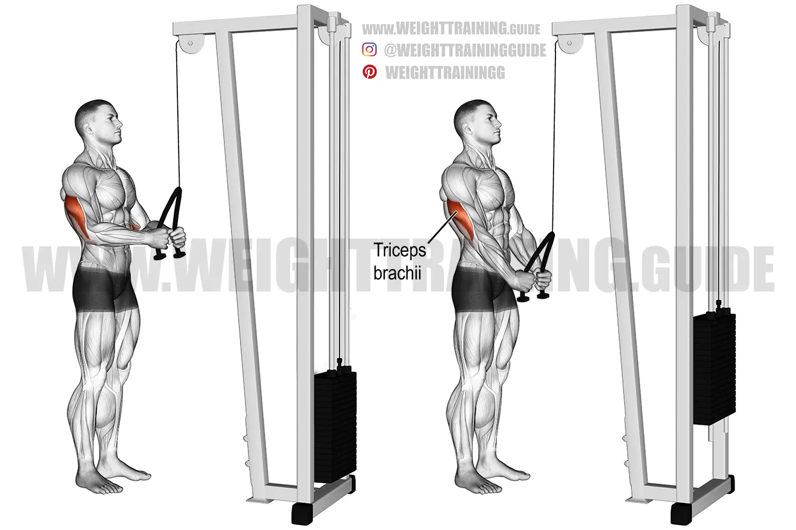

# Triceps

# **1. Rope Tricep Pushdown**

**Target:** Lateral Head (outer horseshoe)

**Level:** Beginner → Advanced

### **How to Do:**

1. Rope ko high pulley par attach karo.
2. Elbows ko sides se chipkao, movement sirf forearms ka ho.
3. Rope ko downward press karo aur **end me rope ko spread** karo.
4. Bottom pe **1–2 sec squeeze**.
5. Slowly rope ko wapas upward aane do.

### **Tips:**

✓ Rope spread = lateral head explode.

✓ Neutral grip wrist-friendly hota hai.

✓ Perfect for warm-up, pump, and finishing.

### **Mistakes:**

❌ Elbows flare.

❌ Back lean karke push karna.

❌ Fast, no-control reps.

### **Remember:**

👉 Triceps ki “cutting lines” yahin se aati hain.

### **Tempo:**

**1 sec down → 1 sec squeeze → 3 sec slow up**

# **2. Straight Bar Pushdown**

**Target:** Lateral + Medial Head

**Level:** Beginner–Intermediate

### **How to Do:**

1. Straight bar ko overhand grip me pakdo.
2. Elbows locked in.
3. Press downward fully until arms straight.
4. Squeeze at bottom.
5. Controlled negative.

### **Tips:**

✓ Thoda heavy weight use kar sakte ho.

✓ Don’t lock elbow aggressively.

✓ Slight forward lean okay (BUT no swinging).

### **Mistakes:**

❌ Using shoulders

❌ Half reps

❌ Bar wrist bend

### **Remember:**

👉 Heaviest tricep pressdown variation.

### **Tempo:**

**1 sec down → 1 sec squeeze → 2–3 sec up**

# **3. V-Bar Pushdown**

**Target:** Lateral Head (thickness)

**Level:** Beginner–Intermediate

### **How to Do:**

1. V-bar ko cable par attach karo.
2. Grip naturally shoulder-width hota hai.
3. Press down with strict form.
4. Bottom pe hard squeeze.
5. Control negative.

### **Tips:**

✓ V-bar = strongest grip = heaviest load possible.

✓ Perfect for strength building.

✓ Keep elbows glued.

### **Mistakes:**

❌ Using too wide stance

❌ Elbow movement

❌ Very fast reps

### **Remember:**

👉 Perfect mix of strength + size.

### **Tempo:**

**1 sec down → 1 sec squeeze → 3 sec up**

# **4. Overhead Rope Extension**

**Target:** Long Head (biggest tricep muscle)

**Level:** Beginner–Intermediate

### **How to Do:**

1. Pulley ko lowest setting pe rakho.
2. Rope ko pakdo aur head ke peeche le jao.
3. Elbows HIGH and close.
4. Rope ko forward & upward extend karo.
5. Stretch at bottom.

### **Tips:**

✓ Long head = biggest mass builder.

✓ Keep elbows pointed UP, not backward.

✓ Full stretch = maximum growth.

### **Mistakes:**

❌ Elbows drift outward

❌ No full stretch

❌ Back arch

### **Remember:**

👉 Big, meaty arms mostly long head se bante hain.

### **Tempo:**

**1–2 sec up → 1 sec squeeze → 3 sec down**

# **5. Overhead Dumbbell Extension (Two-Hand)**

**Target:** Long Head (Maximum Stretch)

**Level:** Beginner

### **How to Do:**

1. Dumbbell ko both hands se hold karo.
2. Elbows ko almost vertical rakho.
3. Lower dumbbell behind head for full stretch.
4. Extend upward fully.
5. Top pe squeeze.

### **Tips:**

✓ Use moderate weight.

✓ Elbows flaring minimize karo.

✓ Lower VERY slow (injury prevention).

### **Mistakes:**

❌ Too heavy dumbbell

❌ Fast reps

❌ No stretch

### **Remember:**

👉 Long head ko stretch = best growth stimulus.

### **Tempo:**

**1.5 sec up → 1 sec hold → 3–4 sec slow down**

# **6. Skull Crushers (EZ Bar)**

**Target:** Long Head + Lateral Head

**Level:** Intermediate

### **How to Do:**

1. Bench par lie karo.
2. EZ-bar ko narrow grip me pakdo.
3. Bar ko forehead ke upar lower karo (controlled).
4. Elbows STATIC rakho.
5. Push upward until full extension.

### **Tips:**

✓ Don’t drop to your actual skull, obviously.

✓ Move only forearms.

✓ Elbows slightly inward angle.

### **Mistakes:**

❌ Elbows flare = shoulder takeover

❌ Momentum

❌ Lowering too fast

### **Remember:**

👉 One of the top 3 tricep mass builders.

### **Tempo:**

**1 sec up → 1 sec hold → 3 sec slow negative**

# **7. Incline Skull Crushers (Stretch Version)**

**Target:** Long Head (Deepest Stretch)**

**Level:** Intermediate–Advanced

### **How to Do:**

1. Bench ko 30° incline par set karo.
2. EZ bar ko head ke peeche lower karo.
3. Extreme stretch feel karo.
4. Then extend upward slowly.

### **Tips:**

✓ Stretch is insane → use LIGHTER weight.

✓ Mind-muscle connection high.

✓ Keep shoulders fully stable.

### **Mistakes:**

❌ Dropping too low

❌ Elbow flare

❌ Back lift

### **Remember:**

👉 Stretch movements long head ko destroy growth mode me daal dete hain.

### **Tempo:**

**1 sec up → 1 sec squeeze → 4 sec negative**

# **8. Close-Grip Bench Press**

**Target:** Lateral + Medial Head (Strength + Mass)**

**Level:** Intermediate–Advanced

### **How to Do:**

1. Barbell ko shoulder-width se thoda narrow pakdo.
2. Elbows ko inside angle par rakho.
3. Bar ko lower chest level par lao.
4. Press upward with tricep focus.

### **Tips:**

✓ This is the HEAVIEST tricep mass builder.

✓ Don’t go TOO narrow, wrists hurt.

✓ Use slow negatives.

### **Mistakes:**

❌ Wide grip (ruins purpose)

❌ Bouncing bar

❌ Flaring elbows

### **Remember:**

👉 Strength + mass combo king for triceps.

### **Tempo:**

**1–2 sec down → 1 sec hold → 1 sec press**

# **9. Tricep Dips (Parallel Bar)**

**Target:** All 3 Heads (BUT heavy on long head)**

**Level:** Intermediate

### **How to Do:**

1. Bars pakdo, body straight rakho.
2. Elbows ko BACKWARD angle me rakho (not flared).
3. Dip down until 90° elbow angle.
4. Push upward using triceps.

### **Tips:**

✓ Lean forward mat karo (wo chest dips hota hai).

✓ Keep feet slightly forward.

✓ Perfect finisher when done slow.

### **Mistakes:**

❌ Shoulder dominant movement

❌ Very deep dips (injury risk)

❌ Swinging

### **Remember:**

👉 Weighted dips = monster triceps.

### **Tempo:**

**2 sec down → 1 sec pause → 2 sec up**

# **10. Bench Dips**

**Target:** Medial + Lateral Head

**Level:** Beginner

### **How to Do:**

1. Hands bench par, feet extended.
2. Elbows ko narrow angle rakho.
3. Lower yourself slowly.
4. Push upward until elbows almost straight.

### **Tips:**

✓ Perfect burnout exercise.

✓ Keep shoulders depressed (down).

✓ Add plate on lap for progression.

### **Mistakes:**

❌ Going too deep

❌ Elbow flare

❌ Fast bouncing reps

### **Remember:**

👉 High reps = crazy pump.

### **Tempo:**

**1 sec down → 1 sec hold → 2–3 sec up**

# **11. Single-Arm Rope Pushdown**

**Target:** Lateral Head (Sharp Definition)**

**Level:** Beginner – Intermediate

### **How to Do:**

1. Rope ko ek side se grip karo (one arm only).
2. Elbow ko body ke side lock rakho.
3. Hand ko downward push karo until full extension.
4. Wrist ko slightly turn karo bottom pe.
5. Slow up movement.

### **Tips:**

✓ One arm = better mind-muscle connection.

✓ Perfect for fixing left–right imbalance.

✓ High reps (12–15) recommended.

### **Mistakes:**

❌ Shoulder use

❌ Elbow moving

❌ Heavy weight

### **Remember:**

👉 For clean arm shape, single-arm pushdowns mandatory.

### **Tempo:**

**1 sec down → 1 sec squeeze → 3 sec up**

# **12. Tricep Kickbacks (Dumbbell)**

**Target:** Lateral Head (Definition & Sharp Lines)**

**Level:** Beginner – Advanced

### **How to Do:**

1. Dumbbell pakdo, back straight forward bend.
2. Elbow ko **upper arm parallel to floor** rakho.
3. From that position, extend dumbbell backward.
4. Top me HARD squeeze.
5. Slow negative.

### **Tips:**

✓ Only bottom half of movement is tricep — keep elbow fixed.

✓ Perfect for sharp arm lines.

✓ Use light weight only.

### **Mistakes:**

❌ Swinging arm

❌ Not locking elbow

❌ Using shoulder

### **Remember:**

👉 This exercises “cuts” your triceps shape.

### **Tempo:**

**1 sec back → 1–2 sec squeeze → 3 sec down**

# **13. Cable Kickback (Single Arm)**

**Target:** Lateral Head (Even Cleaner Than Dumbbell)**

**Level:** Beginner – Intermediate

### **How to Do:**

1. Low cable par single handle attach karo.
2. Slight bend forward.
3. Elbow fixed in place.
4. Pull cable backward until arm is straight.
5. Top pe pause.

### **Tips:**

✓ Cable = perfect constant tension.

✓ Great shaping exercise.

✓ Zero cheating possible.

### **Mistakes:**

❌ Wrist bending

❌ Shoulder movement

❌ No pause at top

### **Remember:**

👉 Best isolation for lateral head shape.

### **Tempo:**

**1 sec extend → 2 sec squeeze → 3 sec negative**

# **14. Close-Grip Push-Ups**

**Target:** Triceps Compound Bodyweight Movement

**Level:** Beginner – Advanced

### **How to Do:**

1. Hands ko chest ke neeche close rakho (diamond optional).
2. Body straight.
3. Down slow.
4. Push upward using **triceps only**.
5. Elbows inward.

### **Tips:**

✓ Warm-up or finisher.

✓ High reps = crazy pump.

✓ Great for at-home training too.

### **Mistakes:**

❌ Hands too wide → chest activate hoga.

❌ Hips dropping

❌ Fast reps without tension

### **Remember:**

👉 Best bodyweight triceps builder (zero equipment).

### **Tempo:**

**2 sec down → 1 sec hold → 2 sec up**

# **15. Cable Rope Overhead Tricep Extension (Two-Hand)**

**Target:** **Long Head (BIG size builder)**

**Level:** Beginner – Intermediate

### **How to Do:**

1. Rope ko lowest setting par attach karo.
2. Machine se thoda aage khade ho aur rope ko head ke peeche lekar jao.
3. Elbows ko **upar fixed** rakho (don’t drop).
4. Arms ko forward & up extend karo.
5. Top pe 1–2 sec **full lock + squeeze**.
6. Down phase ko **4 seconds slow** stretch ke saath karo.

### **Tips:**

✓ Long head ko sabse zyada stretch aur load yahin milta hai.

✓ Rope ko top par **slightly outward** push karo for max squeeze.

✓ Body ko stable rakho.

### **Mistakes:**

❌ Elbow flare

❌ Leaning too much

❌ Fast stretch

### **Remember:**

👉 Triceps SIZE = 60% long head se aati hai.

👉 Is exercise ko end mat karo — yeh STARTING me add karo.

### **Tempo:**

**1 sec up → 2 sec squeeze → 4 sec slow stretch down**

# **16. Cable Single-Arm Overhead Extension**

**Target:** Long Head (Perfect Isolation)**

**Level:** Beginner – Advanced

### **How to Do:**

1. Single handle attach karo.
2. Arm ko fully overhead rakho.
3. Elbow ko ek jagah lock karo.
4. Slow extension upward.
5. Bottom stretch deep rakho.

### **Tips:**

✓ Single arm = imbalance fix.

✓ Mind-muscle bohot strong hota hai.

✓ Use light weight first.

### **Mistakes:**

❌ Over-arching back

❌ Elbow moving forward

❌ Fast tempo

### **Remember:**

👉 Yeh exercise triceps ko **long & full** banati hai.

### **Tempo:**

**1.5 sec up → 1 sec squeeze → 3–4 sec down**

# **17. Cross-Body Cable Extension**

**Target:** Lateral Head (Outer Horseshoe)**

**Level:** Intermediate

### **How to Do:**

1. Cable handle ko shoulder height par set karo.
2. Opposite hand se handle pakdo.
3. Elbow ko body ke side stick karo.
4. **Cross direction** me downward extend karo.
5. Top me squeeze strong.

### **Tips:**

✓ Lateral head ko PERFECTLY isolate karta hai.

✓ Keep arm slightly diagonal.

✓ Mind-muscle next-level.

### **Mistakes:**

❌ Body twisting

❌ Elbow away from body

❌ Fast reps

### **Remember:**

👉 Horse-shoe wali shape **lateral head** banata hai.

### **Tempo:**

**1 sec down → 1 sec hold → 3 sec up**

# **18. Close-Grip Dumbbell Press**

**Target:** Lateral + Long Head (Compound Press)**

**Level:** Intermediate

### **How to Do:**

1. Dumbbells ko together pakdo (neutral grip).
2. Chest press jaisa down-and-up motion.
3. Elbows ko body ke close rakho.
4. Lockout me squeeze.

### **Tips:**

✓ Close grip = triceps overload.

✓ Control motion — no chest involvement.

✓ Great strength builder.

### **Mistakes:**

❌ Flared elbows

❌ Too wide grip

❌ Bouncing dumbbells

### **Remember:**

👉 Barbell close grip se safe alternative.

### **Tempo:**

**1–2 sec down → 1 sec squeeze → 2 sec up**

# **19. Dumbbell Tate Press**

**Target:** Medial + Lateral Head (Unique Angle)**

**Level:** Intermediate – Advanced

### **How to Do:**

1. Flat bench pe lie karo.
2. Dumbbells ko chest ke upar hold karo.
3. Elbows wide, dumbbells ko **inside direction** me lower karo.
4. Upward press by squeezing triceps.

### **Tips:**

✓ Very unique angle → medial head explode.

✓ Light weight use karo first time.

✓ Controlled reps only.

### **Mistakes:**

❌ Dropping dumbbells fast

❌ Using shoulders

❌ Wrong elbow width

### **Remember:**

👉 Tate press = next-level triceps separation exercise.

### **Tempo:**

**2 sec down → 1 sec squeeze → 2–3 sec up**

# **20. Barbell JM Press (Hybrid Skull Crusher + Close Grip)**

**Target:** Lateral + Long Head MASS

**Level:** Advanced (But with light weight beginners also kar sakte)

### **How to Do:**

1. Bench press position lo.
2. Bar ko face/upper chest direction me descend karo.
3. Elbows 45° angle pe rakho.
4. Lockout me triceps ko tight squeeze karo.
5. Control hi sab kuch.

### **Tips:**

✓ LIGHT WEIGHT mandatory.

✓ Perfect hybrid movement (mass + strength).

✓ Slow negatives = elbow safe.

### **Mistakes:**

❌ Ego lifting = elbow pain guaranteed

❌ Flared elbows

❌ Fast reps

### **Remember:**

👉 Powerlifters ka secret tricep builder — unbelievable mass deta hai.

### **Tempo:**

**2 sec down → 1 sec pause → 2 sec controlled up**

# **21. Incline Dumbbell Skull Crusher**

**Target:** Long Head (Deep Stretch Growth)

**Level:** Intermediate

### **How to Do:**

1. Bench ko 30–45° incline pe set karo.
2. Dumbbells ko neutral grip me pakdo.
3. Elbows ko **slightly backward angle** me rakho.
4. Dumbbells ko forehead ke peeche drop hone do — **deep stretch** feel karo.
5. Controlled push back to start position.

### **Tips:**

✓ Incline = deeper long head stretch → maximum triceps size.

✓ Don’t move your shoulders.

✓ Keep elbows narrow & locked.

### **Mistakes:**

❌ Elbows flare wide

❌ Fast reps

❌ Overstretch with heavy weight

### **Remember:**

👉 Long head = 70% tricep mass → this exercise is GOLD.

### **Tempo:**

**2 sec down → 1 sec pause → 2 sec up**

# **22. Double Rope Overhead Extension**

**Target:** Long Head isolation + Maximum Squeeze

**Level:** Beginner – Intermediate

### **How to Do:**

1. Cable machine ke top pulley par **2 ropes** attach karo.
2. Ropes ko overhead pakdo.
3. Elbows stationary rakhte hue arms extend karo.
4. Top pe **maximum stretch + squeeze**.

### **Tips:**

✓ Double rope = bigger range of motion.

✓ Triceps ko fully lengthen karna is key.

✓ Neutral grip maintain karo.

### **Mistakes:**

❌ Elbow drift

❌ Too heavy

❌ Short ROM

### **Remember:**

👉 One of the BEST long-head stretch exercises.

### **Tempo:**

**1 sec up → 1 sec squeeze → 3 sec slow down**

# **23. Standing EZ-Bar French Press**

**Target:** Long Head

**Level:** Intermediate

### **How to Do:**

1. EZ bar ko overhead position me pakdo.
2. Elbows ko locked aur narrow rakho.
3. Bar ko head ke peeche drop karo.
4. Full upward extension.

### **Tips:**

✓ EZ bar = wrist friendly.

✓ Stretch deep low movement.

✓ Chest up, spine neutral.

### **Mistakes:**

❌ Elbow flare

❌ Heavy weights

❌ Shoulders moving

### **Remember:**

👉 Biggest long-head mass builder after skull crusher.

### **Tempo:**

**2 sec down → 1 sec squeeze → 2 sec up**