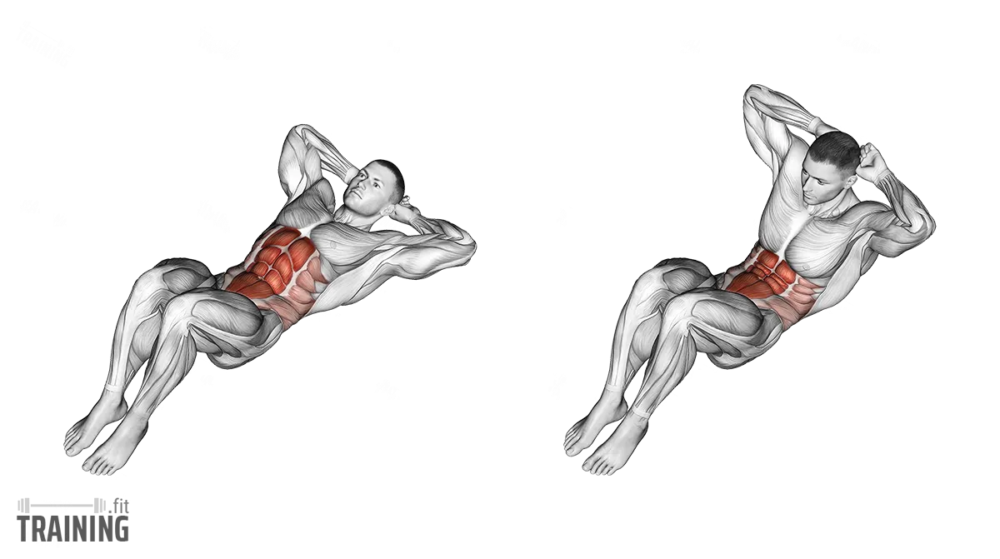

# Abs

## **1. Crunches**

### **How to Do**

- Lay flat, knees bent 90°
- Hands lightly head pe
- Upper back uthaao (2–3 inches)
- Core squeeze karo
- Slow control

### **Sets/Reps:**

3–4 sets × 15–20 reps

### **Tips:**

- Neck pull mat karo
- Upper abs se squeeze feel karo

### **Strength:** Best beginner upper-abs builder

### **Weakness:** Low-range-of-motion

---

## **2. Cable Crunch**

### **How to Do**

1. Rope handle ko cable machine par attach karo
2. Kneel down ho jao
3. Rope ko head ke side pakdo
4. Abse zameen ki taraf crunch karo
5. Elbows ko knees ki taraf lao
6. Slow return position

### **Sets:**

4 × 12–15

### **What to Remember**

- Rope ko pull mat karo—ABS se move karo
- Lower back ko over-bend mat karo
- Weight moderate rakho

### **Strengths**

- Upper abs muscle grow fastest
- Weight add kar sakte ho bodybuilding results ke liye

### **Weakness**

- Galat form = lower back strain

### **Common Mistakes**

❌ Sirf arms se pull karna

❌ Half range of motion

---

## **3. Decline Bench Crunch**

### **How to Do**

1. Decline bench par secure ho jao
2. Hands lightly behind head / chest
3. Full sit-up motion
4. Top par abs squeeze
5. Down slow, full control

### **Sets:** 3–4 × 12–15

### **Remember**

- Neck pull mat karna
- Lower back ko bench se chipka kar utho

### **Strengths**

- High intensity → visible definition
- Build deep core strength

### **Weakness**

- Beginners ke liye thoda tough

### **Mistakes**

❌ Half reps

❌ Fast reps without control

---

## **4. Toe Touches**

### **How to Do**

1. Lay down
2. Legs straight up
3. Arms straight upward
4. Crunch up and touch toes
5. Slow control

### **Sets:** 3 × 15–20

### **Strength →** Upper abs sharp definition

### **Weakness →** Tight hamstrings issue

---

# **5. Hanging Leg Raises (Best Lower Abs Builder)**

### **How to Do (Step-by-Step)**

1. Pull-up bar ko shoulder width grip se pakdo
2. Body completely straight and still
3. Core ko brace karo (as if someone is punching you)
4. Legs ko straight rakhte hue slow upar 90° tak lift karo
5. Top position par **pelvis ko thoda tuck** karo (ABS max squeeze)
6. Slow controlled negative se legs neeche lao
7. Swing bilkul nahi karna

### **Sets & Reps:**

4 sets × 10–15 reps

### **What to Remember**

- Momentum mat use karo
- Breath out at the top
- Lower belly ko squeeze feel karo
- Spine ko arch mat hone do

### **Strengths**

- Lower abs ka best hypertrophy exercise
- Core + hip flexors dono strong
- Fat-loss me help (high intensity)

### **Weakness**

- Beginners ke liye tough
- Swinging se form spoil hoti hai

### **Common Mistakes**

❌ Legs bend karna unnecessarily

❌ Body swing hone dena

❌ Top par squeeze na karna

---

# **6. Reverse Crunch (Lower Abs Isolation)**

### **How to Do**

1. Lay flat, knees 90°
2. Knees ceiling ki taraf lift karo
3. Hips ko bench se upar lift karo
4. Slowly lower back down
5. ABS se movement control

### **Sets:**

3 × 15–20

### **Remember**

- Swing mat karo
- Legs ko throw mat karo
- Lower abs squeeze

### **Strengths**

- Lower abs perfect isolation
- Spine-friendly

### **Weakness**

- Beginners hip flexor use karte hai galti se

### **Mistakes**

❌ Knees ko stomach pe smash karna

❌ Fast reps

---

# **7. Ab Wheel Rollout (Advanced Full-Core Builder)**

### **How to Do**

1. Kneeling position
2. Wheel ko hold karo
3. Slowly aage roll karo jab tak torso stretch ho
4. ABS tight rakho
5. Slow wapas pull karo
6. Lower back arch mat hone do

### **Sets:**

3 × 8–12 reps

### **Remember**

- Belly button inward
- Only go as far as you control
- Lower back protect

### **Strengths**

- Complete abs + core + stability
- Best strength builder for 6-pack

### **Weakness**

- Hard for beginners
- Lower back risk if wrong form

### **Mistakes**

❌ Hips drop kar dena

❌ Full speed reps

---

# **8. Russian Twists (Oblique Shredder)**

### **How to Do**

1. Sit V position
2. Twist left-right
3. Plate add for advanced

### **Sets:** 3 × 30 twists

### **Strength**

- Obliques + rotation strength

### **Weakness**

- Too heavy = back pain

---

# **9. Flutter Kicks (Lower Abs Fat Burner)**

### **How to Do**

1. Lay flat
2. Legs slight up
3. Kick alternate up-down

### **Time:** 30–45 sec

### **Strength** → Fat burning

### **Weakness** → Neck strain if head up too much

---

# **10. Plank (Core Stability King)**

### **How to Do**

1. Elbows under shoulders
2. Body straight
3. Core tight
4. Hold

### **Time:** 30–60 sec

### **Strength** → Full core stability

### **Weakness** → Boring but effective

---

# **11. Bicycle Crunch (Science-Proven Best)**

### **How to Do**

1. Lay flat
2. Elbow to opposite knee
3. Legs pedal motion

### **Sets:** 3 × 20

### **Strength** → Upper + lower + oblique

### **Weakness** → People go too fast

---

# **12. Lying Leg Raises (Lower Abs Isolation + Beginner Friendly)**

### **How to Do (Step-by-Step)**

1. Floor pe straight lay ho jao, hands ko glutes ke neeche rakho support ke liye.
2. Legs straight rakhna — uncrossed.
3. Core ko tight karo (belly inward).
4. Legs ko slow upar 90° angle tak lift karo.
5. Top position par **pelvis ko thoda tuck karo** for maximum lower-abs squeeze.
6. Slow motion me legs neeche lao bina floor touch kare.
7. Full control maintain karo — koi momentum nahi.

### **Sets & Reps:**

4 sets × 12–18 reps

### **What to Remember**

- Lower back ko arch mat hone do.
- Slow negative = 3× more activation.
- Legs ko throw mat karna.
- Breathing:
    - Up = exhale
    - Down = inhale

### **Strengths**

✔ Lower abs ke liye best beginner + intermediate exercise

✔ Spine-friendly

✔ Hip flexors + lower belly tone together

✔ Fat-loss sessions me perfect combo exercise

### **Weakness**

❌ Too fast = hip flexor takeover

❌ Weak lower back wale shuru me struggle karte hain

### **Common Mistakes**

❌ Legs ko jerk ke saath lift karna

❌ Back floor se upar uth jana

❌ Rep fast karna without control

---

# **13. Captain Chair Knee Raise (Lower Abs + Core Stability)**

### **How to Do**

1. Captain chair machine me stand ho jao.
2. Back pad pe firmly rest karo.
3. Legs ko relax rakho.
4. Knees ko chest ki taraf **slowly** raise karo.
5. Top par squeeze hold 1 sec.
6. Slowly neeche wapas.

### **Sets:**

3–4 × 12–15

### **What to Remember**

- Shoulders down and back
- Lower abs ko consciously engage karo
- Don’t swing legs

### **Strengths**

✔ Very stable → easy to control

✔ Great for lower abs hypertrophy

✔ People with poor bar grip can perform this easily

### **Weakness**

❌ Limited range compared to hanging versions

### **Mistakes**

❌ Swinging the knees

❌ Leaning forward excessively

---

# **14. Jackknife Sit-Ups (Upper + Lower Abs Combo)**

### **How to Do**

1. Lay flat with arms overhead
2. Legs straight
3. Ek sath arms + legs ko upar lao
4. Body V-shape banaye
5. Slowly return

### **Sets:** 3 × 12–15

### **Remember**

- Don’t round lower back
- Use controlled reps
- Top par 1 sec squeeze

### **Strengths**

✔ Complete abs activation

✔ Good for definition

### **Weakness**

❌ Tight hamstrings limit range

---

# **15. Weighted Sit-Ups (Upper Abs Mass Builder)**

### **How to Do**

1. Floor ya decline bench pe sit-up position
2. Plate ko chest par hold karo (not behind head)
3. Full sit-up with controlled movement
4. Slow negative for muscle growth

### **Sets:**

4 × 10–12

### **Remember**

- Don’t go too heavy
- Keep chest up
- Avoid neck strain

### **Strengths**

✔ Abs muscle thickness increase

✔ Builds strong upper core

### **Weakness**

❌ Excessive weight = form break

---

# **16. Mountain Climbers (Cardio + Abs Fat Burner)**

### **How to Do**

1. Push-up position
2. Knees ko chest ki taraf rapid motion
3. Hips straight rakho
4. Breathing consistent

### **Time:** 30–40 sec × 3 rounds

### **Remember**

- Don’t lift hips too high
- Keep speed but maintain form

### **Strengths**

✔ Fat loss + abs activation

✔ Conditioning + endurance

### **Weakness**

❌ Beginners lose form quickly

---

# **17. V-Hold (Static Strength Abs)**

### **How to Do**

1. Sit in V-position
2. Legs up, chest up
3. Hold position
4. ABS engaged 100%

### **Time:**

20–30 sec × 3

### **Strengths**

✔ Stability + core tightness

✔ Great for mid abs

### **Weakness**

❌ Hard to maintain form

---

# **18. Side Plank Hip Dips (Oblique Sculptor)**

### **How to Do**

1. Side plank position
2. Hips ko neeche dip
3. Fir upar squeeze
4. Full range motion

### **Sets:**

3 × 12–15 per side

### **Remember**

- Body straight
- Don’t twist too much

### **Strengths**

✔ Obliques definition

✔ Slim waist builder

### **Weakness**

❌ Shoulder fatigue

---

# **19. Cable Woodchoppers (Obliques + Athletic Core)**

### **How to Do**

1. Cable machine high setting pe
2. Rope handle sideways grip
3. Across body downward chop motion
4. Slow negative return

### **Sets:**

3 × 12 per side

### **Remember**

- Rotate torso, not shoulders
- Keep core tight

### **Strengths**

✔ Athletes’ favorite for strong obliques

✔ Burns fat from love handles

### **Weakness**

❌ Wrong angle = low activation

---

# **22. Weighted Russian Twists (Obliques + Serratus Sharpening)**

### **How to Do**

1. Floor pe V-shape baitho (knees 45°, back slightly lean).
2. Chest up, spine neutral.
3. Weight plate/m.ball ko dono hands se pakdo.
4. Torso ko left side twist karo (plate ko side floor ke close).
5. Phir center, then right side.
6. Slow controlled rotational movement.
7. Each side = 1 rep.

### **Sets/ Reps:**

3 sets × 20–30 twists total

### **Remember**

- Lower back ko round mat hone do.
- Speed ke chakkar me form mat todna.
- Only torso rotate kare, hips stable rakho.

### **Strengths**

✔ Obliques burn like hell

✔ Waist definition improve

✔ Builds rotational power (sports benefit)

### **Weakness**

❌ Too heavy = lower back pain risk

❌ Beginners extra lean karte hain → spine stress

### **Mistakes**

❌ Only arms move, torso twist nahi hota

❌ Moving feet

❌ Twists too fast, no squeeze

---

# **23. Plank Knee-to-Elbow (Oblique + Lower Abs Combo)**

### **How to Do**

1. Push-up position me aao.
2. Core ko tight rakho.
3. Right knee ko left elbow ki taraf bring karo.
4. Back to plank.
5. Left knee → right elbow.
6. Slow controlled twist + squeeze.

### **Sets:**

3 × 10–12 each side

### **Remember**

- Hips stability maintain karo
- Full twist karo obliques ko engage karne ke liye
- Breathing smooth rakho

### **Strengths**

✔ Lower + upper + obliques sab hit

✔ Fat-loss friendly

✔ Good for shaping V-line (lower abs)

### **Weakness**

❌ Hips drop → lower back pain

❌ People do too fast → no benefits

### **Mistakes**

❌ Not twisting torso

❌ Knees half-way only

---

# **24. Bicycle Kicks (Upper, Lower, Obliques Together)**

### **How to Do**

1. Lay flat, hands behind head.
2. Legs upar raise karo, 45° angle.
3. Opposite elbow → knee.
4. Left elbow → right knee, right elbow → left knee.
5. Slow + full twist.

### **Sets:**

3 × 20–30 reps

### **Remember**

- Neck pull mat karo
- Only elbows open/close — don’t jerk head
- Full rotation karo

### **Strengths**

✔ MOST effective oblique activation (EMG studies)

✔ Great for fat-burning circuits

✔ Multiple muscles hit → fast fatigue

### **Weakness**

❌ Most people rush

❌ Neck pain agar form galat

### **Mistakes**

❌ Arms se head ko pull karna

❌ Legs ka range low rakhna

---

# **25. Hollow Body Rock (Gymnast-Level Core Control)**

### **How to Do**

1. Hollow hold position banao (legs + arms lifted).
2. ABS tight rakho.
3. Slight forward/backward rock karo.
4. Body shape NOT breaking.

### **Time/Reps:**

3 × 15–20 rocks OR 20–25 seconds

### **Remember**

- Lower back floor ko touch kare ALWAYS
- Belly button inward
- Maintain tight body curve

### **Strengths**

✔ Amazing core stability

✔ Abs shape & control improve

✔ Athletes & gymnasts use this daily

### **Weakness**

❌ Tough for beginners

❌ Back arch = zero benefit

### **Mistakes**

❌ Rock too big

❌ Legs drop down

---

# **26. Side Plank Leg Lift (Obliques + Hip Abductors)**

### **How to Do**

1. Side plank me ao, elbow shoulder ke niche.
2. Body straight line — NO drooping hips.
3. Top leg ko slow upar lift karo.
4. Hip & oblique squeeze feel karo.
5. Slow down, repeat.

### **Sets:**

3 × 10–15 per side

### **Remember**

- Hips HIGH rakhne hai
- Leg lift smoothly, no jerks
- Foot straight, knee locked

### **Strengths**

✔ Obliques + side glutes dono active

✔ Slim waist look enhance

✔ Great for core stability

### **Weakness**

❌ Shoulder fatigue early

### **Mistakes**

❌ Hips drop karna

❌ Leg swing fast

---

# **27. Medicine Ball Slams (Full Body + Abs Explosive Power)**

### **How to Do**

1. Feet shoulder-width.
2. Medicine ball upar overhead lift karo.
3. Core brace karke ball ko ZAMEEN PAR smash karo.
4. Pick up → repeat fast.

### **Sets:**

3 × 12–15 slams

### **Remember**

- Core tight EVERY slam
- Don’t arch lower back
- Use full body engagement

### **Strengths**

✔ Cardio + abs activation

✔ Fat-loss friendly

✔ Explosive core strength

### **Weakness**

❌ Requires good shoulder stability

### **Mistakes**

❌ Only arms use — core involvement 0%

❌ Rounding the back

---

# **28. Low-to-High Cable Woodchopper (Opposite Angle, Different Upper Abs Focus)**

### **How to Do**

1. Cable low setting.
2. Handle hold with straight arms.
3. Diagonal upward chop.
4. Core tight, slight torso rotation.
5. Slow down phase control.

### **Sets:**

3 × 12–15 per side

### **Remember**

- Don’t lean backward
- Control on top position
- Keep elbows locked

### **Strengths**

✔ Entire oblique line

✔ Upper core + serratus hit

✔ Improves rotational stability

### **Weakness**

❌ Too heavy = shoulder pain

### **Mistakes**

❌ Swinging arms

❌ No controlled negative

---

# **29. Heel Touches (Upper Obliques / Side Abs Definition)**

### **How to Do**

1. Crunch position me lay ho jao.
2. Feet hip-width distance.
3. Shoulder blades ground se slightly up.
4. Right hand → right heel touch.
5. Left hand → left heel.
6. Side-to-side continuous reps.

### **Sets:**

3 × 20–30 touches

### **Remember**

- Torso slight crunch position me rakhna
- Only side bend with core, not neck
- Constant tension

### **Strengths**

✔ Easy but very effective

✔ Oblique definition

✔ Burning effect within 10 seconds

### **Weakness**

❌ Limited range; beginners do too little movement

### **Mistakes**

❌ Neck pull

❌ Upper body fully flat ho jana (no tension)

---

# **30. Landmine Twist (Athletic Core + Oblique Power)**

### **How to Do**

1. Landmine barbell ko dono hands se grip karo.
2. Arms straight.
3. Bar ko left side down karo while twisting torso.
4. Then right side.
5. Slow control + slight knee bend.

### **Sets:**

3 × 10–12 each side

### **Remember**

- Don’t twist knees
- Torso rotate with core
- Keep arms locked straight

### **Strengths**

✔ Huge oblique + serratus activation

✔ Great for athletes

✔ Very powerful rotational strength builder

### **Weakness**

❌ Too much weight = dangerous torque

### **Mistakes**

❌ Arms bending

❌ Moving hips instead of torso

---

# **31. Barbell Rollout (Ab Wheel on Steroids)**

### **How to Do**

1. Barbell ko 10–5 kg plates ke saath set karo.
2. Kneeling position se start.
3. Barbell ko slow aage roll karo.
4. Torso almost floor-touching distance par.
5. Core tight rakho; lower back bend nahi hona chahiye.
6. Slow pull back.

### **Sets:**

3 × 8–12

### **Remember**

- Belly in
- Go only as far as your control
- Full tension entire time

### **Strengths**

✔ Full-core overload

✔ Strength + stability + mobility

✔ Better than ab wheel for progression

### **Weakness**

❌ Beginners risk lower back arch

### **Mistakes**

❌ Hips drop → back pain

❌ Rolling too far without control

---

# **32. Bench Leg Pull-Ins (Lower Abs + Tight Core)**

### **How to Do**

1. Bench per sit at edge.
2. Slight lean back, hold bench sides.
3. Legs straight outward.
4. Knees ko chest ke paas bring karo.
5. Slowly extend back.

### **Sets:**

3 × 15–20

### **Remember**

- No swinging legs
- Keep chest high
- Maintain constant tension

### **Strengths**

✔ Lower abs + hip flexors

✔ Great finisher exercise

✔ Easy to control form

### **Weakness**

❌ Too fast = zero lower abs activation

### **Mistakes**

❌ Pulling using momentum

❌ Lower back rounding too much