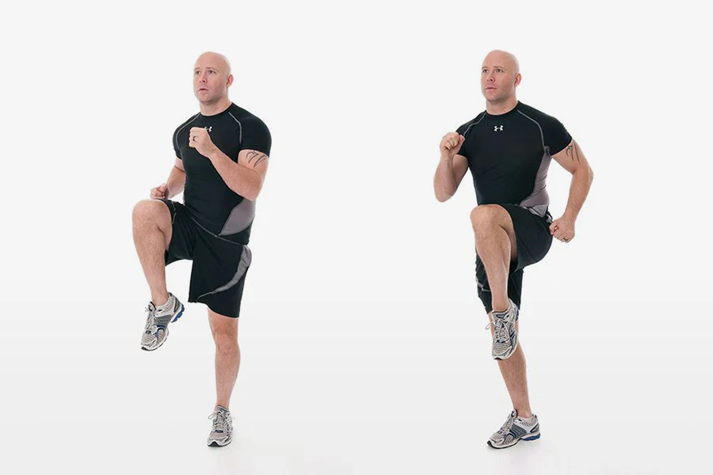

# Cardio

# **1. High Knees (Beginner → Advanced)**

### **Muscles:** Core, Legs, Hip Flexor, Lower Abs

### **Purpose:** Belly fat burn, warm-up + high calorie burn

### ✅ **How to Do**

- Straight khade ho jao, chest up.
- Right knee ko chest tak uthao while left hand forward.
- Rapidly alternate legs, jese spot pe running ho.
- Knees **hip level se upar** leke jao.

### 🫁 **Breathing**

- Fast movement = fast breathing
- Inhale 2 sec → Exhale 2 sec rhythm me.

### ⏳ **Duration / Sets**

- 45 sec ON, 15 sec REST × 3 rounds

### ⚠️ **Mistakes to Avoid**

- Knees low rakhna
- Back bend karna
- Landing heavy (joint pain hota hai)

### 🔥 **Trainer Tips**

- Belly tight rakho = extra lower abs activation
- Start slow → end me sprint mode

---

# **2. Jumping Jacks**

### **Muscles:** Full body, shoulders, legs

### **Purpose:** Body warm-up + Huge calorie burn

### ✅ **How to Do**

- Feet together, hands sides.
- Jump outward, hands overhead.
- Jump back inward, hands down.

### 🫁 Breathing

- Open = inhale
- Close = exhale

### ⏳ Sets/Reps

- 40 sec × 3–4 rounds

### ⚠️ Mistakes

- Land hard
- Arms half range
- Knees locked

### 🔥 Trainer Tip

- Always stay on **toes** for smooth impact.

---

# **3. Mountain Climbers**

### **Muscles:** Abs, Arms, Shoulders, Core

### **Purpose:** Direct lower belly fat target

### ✅ How to Do

- High plank position (straight body).
- Knee ko chest ke andar fast drive karo.
- Hips bilkul stable rakho (upar na uthe).

### 🫁 Breathing

- Fast, rhythmic
- Exhale on knee drive

### ⏳ Sets

- 30–40 sec × 4 rounds

### ⚠️ Mistakes

- Hips upar le jana
- Shoulders back chala jana
- Slow pace

### 🔥 Trainer Tip

- Belly ko squeeze rakho → Belly fat fast burn.

---

# **4. Burpees (King of Weight Loss)**

### **Muscles:** Full body + extreme fat burn

### Purpose: Rapid fat loss

### ✅ How to Do

1. Stand → squat → hands floor
2. Kick legs back → plank
3. Push-up (optional)
4. Jump forward → jump up

### 🫁 Breathing

- Hard movement = natural breathing
- Try exhale while jumping.

### ⏳ Sets

- 10–12 reps × 3 rounds

### ⚠️ Mistakes

- Chest not going down
- Back rounding
- Landing heavy

### 🔥 Trainer Tip

- Do slow burpees if beginner.

---

# **5. Slow → Fast Jog on Treadmill**

### Purpose: Belly fat + stamina

### How to Do

**Warm-up:** 3 min slow

**Jog:** 7–10 min steady

**Finisher:** 1–2 min fast

### Breathing

- Inhale nose → exhale mouth

### Sets

- Total 10–12 min

### Mistakes

- Slouching
- Overstriding
- Watching phone while running

### Tip

- Keep belt middle, not front/back.

---

# **6. Running Stairs**

### Muscles: Legs, glutes, core

### Purpose: Extreme calorie burn

### How to Do

- Use stairs
- Run up fast
- Walk down slow

### Sets

- 10–15 rounds

### Mistakes

- Holding railing
- Going down fast (dangerous)

### Tip

- Lean slightly forward while going up.

---

# **7. Shadow Boxing (Cardio Combat)**

### Muscles: Arms, core, shoulders

### Purpose: Fun fat burning

### How to Do

- Stand fight stance
- Punch jab-cross
- Add hooks, uppercuts
- Move left-right

### Sets

- 1 min × 4 rounds

### Mistakes

- No hip rotation
- Only punching with arms

### Tip

- Squeeze core while punching.

---

# **8. Cycling (Stationary or Outdoor)**

### How to Do

- Medium resistance
- Keep back straight
- Push through forefoot

### Sets

- 10–15 min continuous

### Mistakes

- Knees going outward
- Lean too forward

### Tip

- Increase resistance every 2 minutes.

---

# **9. Incline Walk (Treadmill)**

### Purpose: Belly fat burn WITHOUT running

### How to Do

- Incline: 8–12
- Speed: 4–6 km/h
- Walk with long strides

### Sets

- 10 min

### Mistakes

- Holding handles
- Leaning forward

### Tip

- Keep chest up → burn double calories.

---

# **10. Jump Squats (Explosive Fat Burn)**

### **Muscles:** Quads, glutes, calves, core

### **Purpose:** Extreme calorie + belly fat burn

### ✅ **How to Do**

- Feet shoulder width
- Squat down (hips back, chest up)
- Explosively jump upward
- Land soft → go right back into squat

### 🫁 **Breathing**

- Down = inhale
- Jump = exhale with power

### ⏳ **Sets**

- 12–15 reps × 3–4 rounds

### ⚠️ **Mistakes**

- Knees collapsing inward
- Landing on heels (dangerous)
- Not going full squat

### 🔥 **Trainer Tips**

- Land softly on toes
- Keep belly tight every jump
- Slow movement → no explosion = no benefit

---

# **11. Battle Ropes – Alternating Waves**

### **Muscles:** Arms, shoulders, core, full body

### **Purpose:** Huge calorie + abs engagement

### How to Do

- Stand athletic stance
- Hold ropes
- Alternate both hands up-down fast
- Ropes should make waves

### Breathing

- Fast rhythmic exhale with waves

### Sets

- 30 sec × 4 rounds

### Mistakes

- Small waves
- Standing stiff
- Ropes too heavy

### Tip

- Keep knees slightly bent → more power + safety.

---

# **12. Box Step-Ups (Weighted Optional)**

### Purpose: Leg strength + cardio + fat loss

### How to Do

- One foot on box
- Step up
- Switch leg
- Go continuous fast pace

### Breathing

- Exhale on step-up

### Sets

- 15 reps each leg × 3 rounds

### Mistakes

- Lean forward too much
- Pushing with trailing leg

### Tip

- Push with the foot ON the box.

---

# **13. Skater Jumps**

### Purpose: Side fat + cardio + lower body shaping

### How to Do

- Hop sideways to the right
- Land on right foot
- Left leg behind
- Swing arms
- Repeat opposite

### Sets

- 30–40 sec × 4 rounds

### Mistakes

- Landing stiff
- No arm swing
- Very short jumps

### Tip

- Bigger side-to-side hops = more calorie burn.

---

# **14. Jump Lunges (Explosive Lunges)**

### Muscles: Legs, glutes, core

### Purpose: HIIT-level fat burning

### How to Do

- Lunge down
- Jump up
- Switch legs in air
- Land softness

### Breathing

- Exhale during jump

### Sets

- 12–14 reps each leg × 3 rounds

### Mistakes

- Knees going inward
- Landing too hard
- Using upper body to swing

### Tip

- Keep core tight for balance.

---

# **15. Kettlebell Swings (If Available in Gym)**

### Muscles: Hips, glutes, legs, arms, core

### Purpose: One of best fat-burning exercises

### How to Do

- Feet wide
- KB between legs
- Hips back
- Explosively thrust hips
- KB swings chest height

### Breathing

- Exhale on swing
- Inhale on drop

### Sets

- 15–20 reps × 3–4 rounds

### Mistakes

- Squatting instead of hinging
- Arm lifting (wrong)
- Back rounding (danger!)

### Tip

- Power comes from hips, not arms.

---

# **16. Jumping Lunges + Squat Combo**

### Purpose: Leg cardio + fat burning + stamina boost

### How to Do

- 1 jumping lunge
- 2nd jumping lunge
- 1 jump squat
- Repeat

### Sets

- 10 combos × 3 rounds

### Mistakes

- Knees shaky
- Landing hard
- Back bending

### Tip

- Imagine soft ground → land quietly.

---

# **17. Russian Twist Speed Cardio**

### Muscles:** Obliques + core + shoulders

### Purpose:** Cardio + side belly fat reduction

### How to Do

- Sit, lean back
- Heels slightly above ground
- Twist fast side-to-side
- Touch floor each side

### Sets

- 40–50 twists × 3 rounds

### Mistakes

- Only moving hands
- Neck bending
- Slow twisting

### Tip

- Twist from ribs, not arms.

---

# **18. Elliptical Machine Sprint Mode**

### Purpose: Joint-friendly cardio + huge calorie burn

### How to Do

- Resistance = medium
- Speed = as fast as possible
- Arms + legs both pump fast

### Sets

- 1 min fast
- 1 min slow
- 6–8 rounds

### Mistakes

- Only using legs
- Hunching shoulders
- Machine bouncing

### Tip

- Grip handles gently — don’t pull hard.

---

# **19. Plank Jacks**

### Muscles: Core, shoulders, lower abs

### Purpose: Belly fat + cardio

### How to Do

- Plank position
- Jump feet out
- Jump feet in
- Maintain straight hips

### Sets

- 30–40 sec × 4 rounds

### Mistakes

- Hips up
- Landing heavy
- Slow speed

### Tip

- Keep belly tight whole time.

---

# **20. Boxer Shuffle (Footwork Cardio)**

### Purpose:** Light cardio + continuous fat burn

### How to Do

- Shift weight left–right
- Small hops
- Hands up in guard position
- Stay on toes

### Sets

- 1 min × 4 rounds

### Mistakes

- Heavy landing
- Flat feet
- Static body

### Tip

- Move as if avoiding punches.

---

# **21. Fast Butt Kicks**

### Purpose:** Lower belly + thigh fat burn + warmup

### How to Do

- Jog in place
- Kick heels up to butt
- Go fast
- Arms swing naturally

### Sets

- 45 sec × 3 rounds

### Mistakes

- Heel not reaching high
- Leaning forward too much

### Tip

- Keep chest upright → better breathing.

---

# **22. Mini-Hurdle Lateral Runs (If No Hurdle → Use Floor Line)**

### Purpose:** Side fat burn + agility + extreme calorie burn

### How to Do

- Draw a straight line
- Quickly step sideways across line
- Tap ground
- Repeat fast

### Sets

- 30 sec × 4 rounds

### Mistakes

- Feet too slow
- Staying too upright
- Crossing legs

### Tip

- Bend knees slightly → faster movement.

---

# **23. Frog Jumps (Explosive Fat-Burner)**

### **Muscles:** Legs, glutes, lower abs, lungs

### **Purpose:** Extreme calorie burn + lower belly fat

### ✅ **How to Do**

- Deep squat down
- Hands touch floor
- Explode forward like a frog
- Land soft → repeat

### 🫁 **Breathing**

- Inhale while squatting
- Exhale on explosive jump

### ⏳ **Sets**

- 10–12 jumps × 3 rounds

### ⚠️ **Mistakes**

- Short jumps
- Knees collapsing
- Landing hard

### 🔥 **Trainer Tip**

- Each jump should be powerful — quality matters, not speed.

---

# **24. Agility Ladder – Fast Feet Drills**

### **Purpose:** Quickness + cardio + belly fat burn

### **How to Do**

- Place agility ladder
- Step in-out quickly
- Light feet, fast timing
- Maintain forward lean

### **Sets**

- 20–30 sec × 4 rounds

### **Mistakes**

- Heavy steps
- Looking down continuously
- Slow speed

### **Tip**

- Move like an athlete — stay on toes.

---

# **25. Turkish Get-Up (Light Weight)**

### **Muscles:** Core, shoulders, legs

### **Purpose:** Strength + cardio together

### **How to Do**

1. Lie down
2. Hold dumbbell up
3. Stand up step-by-step
4. Reverse back down

### **Sets**

- 5 reps each side × 3 rounds

### **Mistakes**

- Rushing movement
- Knees turning in
- Wrong shoulder alignment

### **Tip**

- Keep eyes on dumbbell entire movement.

---

# **26. Farmer’s Carry (Fast Walk)**

### **Purpose:** Strength + cardio + core tightening

### **How to Do**

- Hold dumbbells heavy
- Walk fast 20–30 meters
- Keep chest up tight

### **Sets**

- 4 rounds

### **Mistakes**

- Slouching
- Small steps
- Moving too slow

### **Tip**

- Keep shoulders back → better core activation.

---

# **27. Jump Tucks (Explosive Cardio)**

### **Muscles:** Lower abs, legs

### **Purpose:** Maximum belly activation

### **How to Do**

- Stand
- Jump up
- Bring knees to chest
- Land soft

### **Sets**

- 8–12 reps × 3 rounds

### **Mistakes**

- Knees low
- Landing loud
- Neck stiff

### **Tip**

- Think: “knees to chest quickly”.

---

# **28. Box Jumps (Explosive Power + Cardio)**

### **Muscles:** Legs, glutes, calves, core

### **Purpose:** Extreme explosive calorie burn

### ✅ **How to Do**

- Stand in front of box/bench
- Bend knees slightly
- Swing arms → explode up
- Land soft with knees bent
- Step down (don’t jump down)

### 🫁 Breathing

- Exhale on jump
- Inhale while stepping down

### ⏳ Sets

- 8–10 jumps × 3–4 rounds

### ⚠️ Mistakes

- Jumping down (risk injury)
- Leaning too forward
- Using only legs, no arm swing

### 🔥 Tip

- Imagine landing like a cat → soft + controlled.

---

# **29. Plank Walkouts (Walk + Reach)**

### **Purpose:** Core + shoulders + cardio

### How to Do

- Stand tall
- Bend forward
- Walk hands into plank
- Walk hands back
- Stand up
- Repeat fast

### Sets

- 12–15 reps × 3 rounds

### Mistakes

- Rushing with poor form
- Hips sagging
- Not standing full up

### Tip

- Engage belly when walking back.

---

# **30. Duck Walk + Jog Back**

### **Purpose:** Intense leg + cardio burn

### How to Do

- Go into deep squat
- Walk forward 6–8 steps
- Stand → jog back
- Repeat

### Sets

- 30 sec × 4 rounds

### Mistakes

- Hips going up
- Leaning too forward

### Tip

- Stay low entire duck walk for maximum burn.