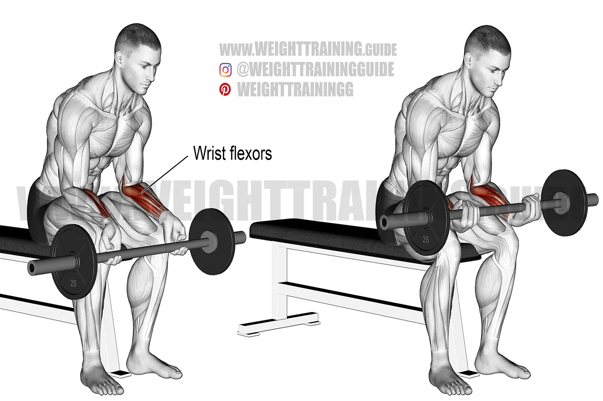

# Forearm

# **1. Barbell Wrist Curl (Seated)**

**Target:** Wrist FLEXORS (Under forearm mass)

**Level:** Beginner → Intermediate

### **How to Do:**

1. Bench pe baith jao, barbell ko underhand grip me pakdo.
2. Forearms thighs par rakho, wrists bench ke aage latak rahe.
3. Wrists se barbell ko upar curl karo (ONLY WRIST MOVES).
4. Top pe squeeze 1 sec.
5. Down full stretch jab tak forearm me burn na aaye.

### **Tips:**

✓ Light weight = better growth

✓ Full stretch = maximum muscle recruitment

✓ Keep elbow and forearm stable

### **Common Mistakes:**

❌ Too heavy → zero form

❌ Moving elbows

❌ Short reps

### **Remember:**

👉 This is the KING of forearm mass builders.

👉 Stretch is 50% of the growth.

### **Tempo:**

**1 sec up → 1 sec squeeze → 3 sec slow down**

---

# **2. Reverse Barbell Wrist Curl**

**Target:** Wrist EXTENSORS (Upper forearm definition)

**Level:** Beginner

### **How to Do:**

1. Barbell ko overhand grip me pakdo.
2. Forearms thighs par rakho, wrists edge se bahar.
3. Wrists ko upward curl karo.
4. Downwards slow.

### **Tips:**

✓ Light weight only

✓ Perfect for ‘forearm lines’

✓ Squeeze hard at the top

### **Mistakes:**

❌ Using biceps

❌ Not stretching fully

### **Tempo:**

**1 sec up → 1 sec hold → 3 sec down**

---

# **3. Dumbbell Wrist Curl (One Arm)**

**Target:** Flexors (Isolated)

**Level:** Beginner → Intermediate

### **How to Do:**

1. Thigh par forearm rakho.
2. Dumbbell ko underhand grip me pakdo.
3. Wrists ko slow curl karo.
4. Down full stretch tak jao.

### **Tips:**

✓ Single arm = better imbalance correction

✓ Slow movement = crazy burn

### **Mistakes:**

❌ Speed reps

❌ Wrong angle

### **Tempo:**

**1 sec up → 1 sec squeeze → 3–4 sec stretch**

---

# **4. Dumbbell Reverse Wrist Curl**

**Target:** Extensors (Upper forearm cuts)**

**Level:** Beginner

### **How to Do:**

1. Dumbbell ko overhand grip me pakdo.
2. Wrists ko upward curl karo.
3. Full slow negative lo.

### **Tips:**

✓ Lightest weight works best

✓ Focus on top contraction

### **Remember:**

👉 Upper forearm SHAPE issi exercise se banti hai.

---

# **5. Hammer Curl (Forearm Version)**

**Target:** Brachioradialis + Forearm Thickness

**Level:** Beginner → Intermediate

### **How to Do:**

1. Hammer grip me dumbbells pakdo.
2. Curl straight upward without rotating wrist.
3. Down slow.

### **Tips:**

✓ Heavy weight allowed

✓ Hammer + slow negative = insane forearm growth

### **Mistakes:**

❌ Swinging

❌ Shoulder use

### **Tempo:**

**1.5 sec up → 3 sec down**

---

# **6. Reverse Curl (EZ Bar)**

**Target:** Forearm Extensors + Brachialis

**Level:** Beginner → Intermediate

### **How to Do:**

1. EZ Bar ko overhand grip se pakdo.
2. Curl upwards.
3. Down slow.

### **Tips:**

✓ Reverse curls = best full-forearm activator

✓ Light to moderate weight works best

---

# **7. Plate Pinch Hold**

**Target:** Grip Strength + Finger Muscles

**Level:** Beginner → Advanced

### **How to Do:**

1. 2 small plates ko fingertips se pinch pakdo.
2. Hold for 20–40 sec.
3. Repeat.

### **Tips:**

✓ Don’t drop plate

✓ Thumb pressure maintain karo

### **Remember:**

👉 Yeh Iron Grip build karega.

---

# **8. Dead Hang (From Pull-Up Bar)**

**Target:** Grip Endurance + Forearm Density

**Level:** Beginner → Intermediate

### **How to Do:**

1. Pull-up bar se dead hang karo.
2. Hold for 20–60 sec.
3. Core tight, wrist locked.

### **Tips:**

✓ Best grip builder ever

✓ Increases pull-up strength

✓ Improves wrist stability

### **Mistakes:**

❌ Bending elbows

❌ Loose core

---

# **9. Behind-the-Back Barbell Wrist Curl**

**Target:** Wrist Flexors (Lower Forearm Pump)

**Level:** Beginner – Advanced

### **How to Do:**

1. Barbell ko thighs ke peeche hold karo (palms facing back).
2. Arms straight but relaxed.
3. Wrist ko curl karte hue bar ko upward lift karo using only wrists.
4. Top pe squeeze.
5. Down full stretch.

### **Tips:**

✓ Yeh forearms ko **crazy pump** deta hai.

✓ Light weight → high reps (15–20).

✓ Bar ko fingertips pe aane do for full stretch.

### **Mistakes:**

❌ Torso swing

❌ Wrist hyperextend

❌ Heavy weight use karna

### **Remember:**

👉 Lower forearms ko thick banane ke liye top 3 exercises me se ek.

### **Tempo:**

**1 sec up → 1 sec squeeze → 2–3 sec down**

# **10. Reverse Barbell Curl (Shoulder-Width Grip)**

**Target:** Brachialis + Upper Forearms + Brachioradialis

**Level:** Beginner – Intermediate

### **How to Do:**

1. Barbell ko **overhand grip** se pakdo (shoulder-width).
2. Elbows tight, wrists straight.
3. Curl barbell upward only by bending elbows.
4. Top pe **forearm contraction feel** karo.
5. Down slow with full stretch.

### **Tips:**

✓ Light–moderate weight best results deta hai.

✓ Upper forearm (brachioradialis) bohot active hota hai.

✓ Don’t rotate wrist.

### **Mistakes:**

❌ Excessive wrist bending (injury risk)

❌ Swinging the weight

❌ Using shoulders

### **Remember:**

👉 Reverse grip = forearm size + thickness ka king exercise.

### **Tempo:**

**1–2 sec up → 1 sec squeeze → 3 sec slow down**

---

# **11. Cable Wrist Curl (Underhand Grip)**

**Target:** Lower Forearm (Flexors)

**Level:** Beginner – Intermediate

### **How to Do:**

1. Cable ko lowest level par rakho.
2. Small straight bar use karo.
3. Kneel or sit close → forearms bench par rakho.
4. Wrist ko fully flex karo → top squeeze.
5. Down slow stretch.

### **Tips:**

✓ Cable tension constant hota hai = better pump.

✓ Lower forearms insane burn honge.

✓ Slow tempo best.

### **Mistakes:**

❌ Lifting elbows

❌ Fast bouncing

❌ No stretch

### **Remember:**

👉 Lower forearm thickness = huge grip impression.

### **Tempo:**

**1 sec up → 1 sec squeeze → 3–4 sec down**

---

# **12. Cable Reverse Wrist Curl (Overhand Grip)**

**Target:** Upper Forearms (Extensors)

**Level:** Beginner – Intermediate

### **How to Do:**

1. Straight bar ko cable me overhand grip se pakdo.
2. Forearms bench par, wrists hanging.
3. Wrist ko upward curl karo.
4. Top hold, down slow.

### **Tips:**

✓ Wrists upward curve = extensor activation.

✓ Very light weight use karo.

✓ High reps (15–20) perfect.

### **Mistakes:**

❌ Heavy weight

❌ Speed reps

❌ Forearm swing

### **Remember:**

👉 Strong extensors = complete forearm & injury-free training.

### **Tempo:**

**1 sec up → 1 sec hold → 3 sec down**

---

# **13. Cable Wrist Flexion (Low Pulley)**

**Target:** Forearm Flexors (Inner Forearm)

**Level:** Beginner – Intermediate

### **How to Do:**

1. Cable low position par straight bar attach karo.
2. Kneel/sit karke forearm pad par rest karo.
3. Palms up grip se wrist curl upward.
4. Top me squeeze 1 sec.
5. Down slow stretch.

### **Tips:**

✓ Cable = constant tension.

✓ Very good for finishing sets.

✓ Stretch is most important.

### **Mistakes:**

❌ Using elbow

❌ Too heavy

❌ No squeeze

### **Remember:**

👉 Flexors = inner forearm thickness.

### **Tempo:**

**1 sec up → 1 sec squeeze → 3 sec down**

---

# **14. Cable Wrist Extension (Low Pulley)**

**Target:** Forearm Extensors (Outer Forearm)

**Level:** Beginner – Intermediate

### **How to Do:**

1. Same setup but palms DOWN grip.
2. Wrists ko upward extend karo.
3. Top me squeeze 1 sec.
4. Down slow.

### **Tips:**

✓ Light weight ONLY.

✓ Keep wrist straight, no bending sideways.

✓ Very important for balanced strength.

### **Mistakes:**

❌ Jerking

❌ No control

❌ Grip too loose

### **Remember:**

👉 Extensor training = no wrist pain when curling.

### **Tempo:**

**1 sec up → 1 sec hold → 3 sec down**