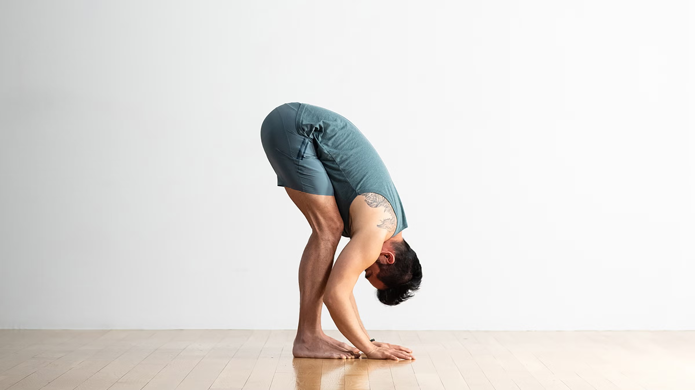

# Stanching

# **1. Standing Forward Fold (Hamstring Stretch)**

**Time:** 25–30 sec

**Body Parts:** Hamstrings, calves, lower back

**Breathing:** Inhale up, exhale down

### ✅ How to Do

- Stand straight
- Bend forward slowly from hips
- Try touching toes
- Keep knees slightly soft

### ⭐ Remember

✔ Don’t round lower back too much

✔ Go down slowly

✔ Relax neck

### ❌ Avoid

✘ Jerking or bouncing

✘ Locking knees fully

**Purpose:**

Releases tight hamstrings, improves flexibility & reduces lower back stiffness.

---

# **2. Standing Quad Stretch**

**Time:** 25–30 sec each leg

### How to Do

- Stand tall
- Grab ankle
- Pull foot toward glutes
- Keep knees together

### Remember

✔ Press hips forward

✔ Keep body straight

### Avoid

✘ Pulling ankle sideways

✘ Leaning forward

**Purpose:**

Perfect after leg workout; loosens thigh muscles.

---

# **3. Chest Doorway Stretch**

**Time:** 20–25 sec each side

**Muscles:** Chest, shoulders

### How to Do

- Stand in doorway
- Place forearm on door
- Lean forward gently

### Remember

✔ Keep shoulder down

✔ Chest lifted

### Avoid

✘ Overstretching

✘ Twisting neck

**Purpose:**

Amazing for chest tightness after push day.

---

# **4. Overhead Tricep Stretch**

**Time:** 20–25 sec each arm

### How to Do

- Raise one arm overhead
- Bend elbow
- Push elbow backward gently

### Remember

✔ Keep ribs down

✔ Stretch should be mild

### Avoid

✘ Pulling too hard

**Purpose:**

Releases triceps & lats.

---

# **5. Cross-Body Shoulder Stretch**

**Time:** 20 sec each arm

### How to Do

- Bring arm across chest
- Pull with opposite arm
- Keep shoulder relaxed

### Remember

✔ Gentle pull

✔ Don’t twist torso

### Avoid

✘ Raising shoulder upward

---

# **6. Cobra Stretch (Abdominal Stretch)**

**Time:** 20–30 sec

**Muscles:** Abs, lower back, hip flexors

### How to Do

- Lie face down
- Push chest up
- Keep hips on ground

### Remember

✔ Look slightly upward

✔ Don’t squeeze lower back too hard

### Avoid

✘ Overarching

---

# **7. Seated Butterfly Stretch (Inner Thigh)**

**Time:** 30–40 sec

**Muscles:** Adductors, groin area

**Breathing:** Slow inhale–exhale

### ✅ **How to Do**

1. Sit down.
2. Bring soles of feet together.
3. Hold ankles.
4. Push knees down gently with elbows.
5. Keep back straight.

### ⭐ **Remember**

✔ Keep spine tall

✔ Push knees gently

✔ No leaning backward

### ❌ **Avoid**

✘ Rounding back

✘ Pushing knees too hard

### 🎯 **Purpose**

Opens groin, improves squat depth, reduces hip stiffness.

---

# **8. Seated Hamstring Stretch (Single Leg)**

**Time:** 30 sec each

### How to Do

- One leg extended
- One leg bent
- Reach for toes

---

# **9. Frog Stretch (Deep Hip Opener)**

**Time:** 30–45 sec

**Muscles:** Inner thighs (adductors), hips, groin

**Best For:** Squat depth, hip mobility, flexibility

**Breathing:** Long exhales

### ✅ **How to Do**

1. Come on knees.
2. Spread knees wide (like frog legs).
3. Elbows on floor, hips in line with knees.
4. Slowly push hips backward.
5. Hold a deep but comfortable stretch.

### ⭐ **Remember**

✔ Keep ankles aligned with knees

✔ Move hips gently backward to increase stretch

✔ Keep spine straight — don’t collapse chest

### ❌ **Avoid**

✘ Forcing too much stretch initially

✘ Knees too wide too fast

✘ Lower back rounding

### 🎯 **Purpose**

This stretch opens hips for heavy squats, deadlifts, lunges, and relieves groin tightness.

---

# **10. Lying Figure-4 Stretch (Glutes + Lower Back)**

**Time:** 30 sec each

**Muscles:** Piriformis, glutes

**Breathing:** Exhale while pulling legs

### ✅ **How to Do**

1. Lie on your back.
2. Cross right ankle over left knee.
3. Pull legs toward chest using hands.
4. Keep head and neck relaxed.

### ⭐ **Remember**

✔ Pull gently — stretch must NOT hurt

✔ Flex the foot of crossed leg to protect knee

### ❌ **Avoid**

✘ Pulling too hard

✘ Twisting spine

### 🎯 **Purpose**

Releases tight glutes, fixes lower-back stiffness, improves hip rotation.

---

# **11. Wrist Flexor Stretch**

**Time:** 20–25 sec each side

**Muscles:** Forearms, wrists

**Breathing:** Relaxed

### ✅ **How to Do**

1. Extend arm straight.
2. Pull fingers downward using opposite hand.
3. Stretch forearm’s upper side.

### ⭐ **Remember**

✔ Keep elbow straight

✔ Gentle pressure only

### ❌ **Avoid**

✘ Overstretching

✘ Locking wrist too hard

### 🎯 **Purpose**

Excellent for push movements (bench, push-ups, dips).

---

# **12. Pigeon Stretch (Deep Glute + Piriformis Release)**

**Time:** 30–45 sec each leg

**Primary Muscles:** Gluteus maximus, glute medius, piriformis

**Secondary:** Hip external rotators

**Intensity:** Deep stretch (very effective)

---

### ✅ **How to Do (Slow & Safe Guide)**

1. Bring one knee forward (example: right knee).
2. Your right shin goes diagonally across the floor.
3. Extend left leg fully backward.
4. Keep hips facing straight forward (this is the key).
5. Slowly lean forward with a straight spine.
6. Stop when you feel deep glute stretch.

---

### ⭐ **Ideal Form Tips**

✔ Keep hips level — place pillow under hip if needed

✔ Stay on your thigh muscle, not knee joint

✔ Chest forward, spine long

---

### ❌ **Avoid**

✘ Sitting only on one glute

✘ Twisting your lower back for extra depth

✘ Painful pressure on knee

---

### 🎯 **Purpose & Benefits**

- Removes glute tightness
- Eliminates sciatic nerve pressure
- Essential after leg workouts
- Perfect for athletes needing strong hip mobility

This is a **top 3 glute mobility stretch globally**.

---

# **13. Seated Side Bend Stretch (Obliques + Lat Expansion)**

**Time:** 25–35 sec each side

**Primary Muscles:** Lats, obliques, intercostals

**Secondary:** Serratus anterior

**Best For:** Overhead press, pull-ups, wide lats

---

### ✅ **How to Perform**

1. Sit cross-legged or on knees.
2. Raise your right arm straight up.
3. Slowly bend toward your **left side**.
4. Keep both hips firmly on the ground.
5. Lean only sideways — no twisting.

---

### ⭐ **Key Cues**

✔ Stretch should be felt on side body & lats

✔ Keep arm straight

✔ Pull shoulder back slightly

---

### ❌ **Avoid**

✘ Twisting torso

✘ Leaning forward

---

### 🎯 **Benefits**

- Opens lats for pull-ups
- Improves rib mobility
- Enhances breathing capacity
- Helps posture

---

# **14. Full Lats Stretch “Hanging Lat Stretch”**

**Time:** 20–30 sec

**Muscles:** Lats, triceps, shoulder capsule, spine

**Breathing:** Deep rib expansion

### ✅ **How to Do**

1. Hold a pull-up bar lightly.
2. Let your body relax downward.
3. Keep feet on ground so stretch is safe.
4. Feel ribs open & lats expand.

### ⭐ **Remember**

✔ Don’t hang full body weight

✔ Keep shoulders slightly active

✔ Slow breathing into ribs

### ❌ **Avoid**

✘ Full dead hang if shoulder is weak

✘ Jerking down

### 🎯 **Purpose**

Huge lat flexibility boost → essential for pull-ups and deadlifts.