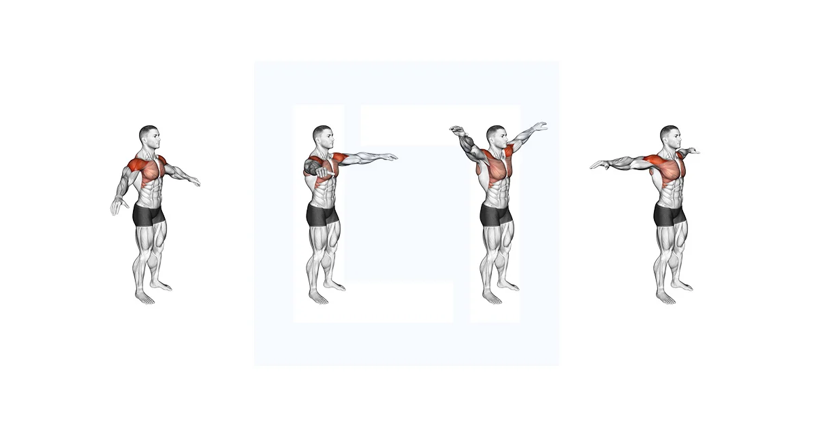

# Warm Up

### **1️⃣ Warm-up time**

**8–12 minutes** total

(Advanced athletes: up to 15 minutes)

### **2️⃣ Intensity**

Start slow → increase blood flow → activate muscles

3️⃣ **Breathing**

✔ Inhale (through nose) during easy phase

✔ Exhale (through mouth) during effort phas

4️⃣ **Never Warm-Up Fast**

Warm-up = slow & controlled

Speed = for workouts, not warm-up

---

# **1. Arm Circles (Forward & Backward)**

**Body Parts:** Shoulders, rotator cuff, upper back

**Sets/Reps:** 2 sets × 20–20 each direction

**Breathing:** Normal breathing

### **How to Do**

- Stand straight
- Extend both arms sideways
- Start making slow circles
- First small → medium → large circles
- Do forward first → then backward

### **What You MUST Do**

✔ Keep core tight

✔ Move arms in full range

✔ Slow & controlled movement

### **What NOT To Do**

✘ Don’t rush

✘ Don’t bend elbows

✘ Don’t shrug shoulders upward

### **Purpose**

Warms shoulders + prepares rotator cuff for pushing/pulling exercises.

---

# **2. Neck Mobility Rotations**

**Body Parts:** Neck, traps

**Sets/Reps:** 1 set × 10 rotations each direction

**Breathing:** Slow, deep breathing

### **How to Do**

- Straight posture
- Slowly rotate neck clockwise
- Repeat anti-clockwise

### **What To Remember**

✔ Slowest movement wins

✔ Keep shoulders relaxed

### **Avoid**

✘ Fast rotations → injury risk

✘ Over-stretching

---

# **3. Wrist Circles**

**Body Part:** Wrists, forearms

**Sets/Reps:** 2 × 15 each direction

### **How to Do**

- Rotate wrists in circular motion
- Slow and controlled

### **Remember**

✔ Very important for push-ups, bench, biceps

### **Avoid**

✘ Sudden snapping

---

# **4. Ankle Circles**

**Body Part:** Ankles, calves

**Sets/Reps:** 2 × 20 (each foot)

### **Do**

- Rotate ankles clockwise & anti-clockwise

### **Purpose**

Prevents ankle sprains during leg day or treadmill.

---

# **5. Jumping Jacks**

**Body Part:** Full body warm-up

**Sets/Reps:** 2 × 30 seconds

### **How to Do**

- Jump lightly
- Arms overhead
- Feet apart and together rhythmically

### **Remember**

✔ Soft landing

✔ Straight posture

### **Avoid**

✘ Hard landing

✘ Excess speed

---

# **6. High Knees (Light Warm-up Version)**

**Body Parts:** Hip flexors, core, quads

**Sets/Reps:** 2 × 20–30 seconds

### **How to Do**

- Jog in place
- Lift knees up to waist level

### **Purpose**

Increases heart rate + warms legs

---

# **7. Hip Circles**

**Body Parts:** Hips, lower back, glutes

**Sets/Reps:** 1 × 20 each side

### **How to Do**

- Hands on waist
- Rotate hip in a big circle

### **Avoid**

✘ Over rotating

✘ Twisting your spine

---

# **8. Cat–Cow Stretch**

**Body Parts:** Spine, core, lower back

**Sets/Reps:** 2 × 8–12 reps

### **How to Do**

- On all fours
- Arch spine (cow)
- Round spine (cat)

### **Remember**

✔ Perfect for anyone with back stiffness

---

# **9. Shoulder Shrugs Warm-Up**

**Body Parts:** Traps, neck, shoulders

**Sets/Reps:** 2 × 15 reps

### **How to Do**

- Lift shoulders up
- Hold for 1 sec
- Release down

### **Avoid**

✘ Fast shrugging

✘ Rotating aggressively

---

# **10. Torso Twists (Standing)**

**Body Parts:** Obliques, core, lower back

**Sets/Reps:** 2 × 20 twists

### **How to Do**

- Stand straight
- Rotate torso left → right in controlled motion
- Keep hips stable

### **Remember**

✔ Engage core

✔ Keep movement fluid

---

# **11. Hip Flexor Dynamic Warm-Up (Leg Swings Front-to-Back)**

**Body Parts:** Hip flexors, hamstrings, glutes

**Sets/Reps:** 2 × 15 each leg

**Breathing:** Exhale during forward swing

### ✅ **How to Do**

- Hold wall/support
- Swing one leg forward and back
- Stay tall
- Do NOT bend your back

### ⭐ **Remember**

✔ Control the leg

✔ Small swings → medium → full

✔ Foot straight, not rotated

### ❌ **Avoid**

✘ Kicking too high

✘ Twisting hips

✘ Rapid uncontrolled swings

### 🎯 **Purpose**

Prepares hips for squats, lunges, deadlifts, leg press.

---

# **12. Lateral Leg Swings (Side-to-Side)**

**Body Parts:** Hip abductors, adductors, glutes

**Sets/Reps:** 2 × 15 each leg

**Breathing:** Normal

### ✅ **How to Do**

- Stand facing forward
- Swing leg side-to-side like a door
- Keep torso still
- Controlled motion

### ⭐ **Remember**

✔ Hips level

✔ Don’t lean sideways

✔ Smooth pace

### ❌ **Avoid**

✘ Swinging too wide

✘ Using lower back to move the leg

### 🎯 **Purpose**

Opens hips from both sides → perfect before leg day or running.

---

# **13. Dynamic Quad Stretch Walk**

**Body Parts:** Quads, hip flexors

**Sets/Reps:** 1 set × 20 steps

**Breathing:** Normal

### ✅ **How to Do**

- Walk forward
- Grab ankle
- Pull heel to glute
- Reach opposite hand upward
- Step forward into next rep

### ⭐ **Remember**

✔ Keep knee pointing down

✔ Pull ankle gently

✔ Keep core tight

### ❌ **Avoid**

✘ Leaning forward

✘ Pulling too aggressively

✘ Twisting hip

### 🎯 **Purpose**

Activates quads and stretches them dynamically — best before squats & running.

---

# **14. Glute Bridge Activation**

**Body Parts:** Glutes, lower back, hips

**Sets/Reps:** 2 × 15 reps

**Breathing:** Exhale when lifting hips

### ✅ **How to Do**

- Lie on back
- Knees bent
- Lift hips upward
- Squeeze glutes at top
- Lower slowly

### ⭐ **Remember**

✔ Push through heels

✔ Squeeze glutes hard for 1 sec

✔ Keep ribs down

### ❌ **Avoid**

✘ Using lower back

✘ Hyper-extending spine

### 🎯 **Purpose**

Activates glutes → improves squats, deadlifts, hip thrusts.

---

# **15. Knee-to-Chest Walk (Dynamic Glute Stretch)**

**Body Parts:** Glutes, hips, hamstrings

**Sets/Reps:** 1 × 20 steps

### ✅ **How to Do**

- Walk forward
- Pull one knee to chest
- Hold 1 second
- Step and switch

### ⭐ **Remember**

✔ Keep posture tall

✔ Pull knee vertically

✔ Controlled movement

### ❌ **Avoid**

✘ Leaning backward

✘ Jerking

### 🎯 **Purpose**

Opens glutes + hips and improves lower-body mobility.

---

# **16. Reverse Lunges with Rotation**

**Body Parts:** Glutes, quads, core, spine

**Sets/Reps:** 2 × 10 each side

### ✅ **How to Do**

- Step back into a lunge
- Rotate torso toward front leg
- Keep rotation smooth
- Stand up and switch sides

### ⭐ **Remember**

✔ Balance on front heel

✔ Keep chest up

✔ Rotation from the upper spine, NOT lower back

### ❌ **Avoid**

✘ Knee caving inward

✘ Fast rotation

✘ Over-twisting spine

### 🎯 **Purpose**

Core + legs + mobility → perfect before leg day or full-body training.

---

# **17. Side Lunges (Dynamic Lateral Warm-Up)**

**Body Parts:** Inner thighs (adductors), glutes, hips

**Sets/Reps:** 2 × 10 each side

### ✅ **How to Do**

- Stand wide
- Shift weight to one side
- Sit hips back
- Keep other leg straight
- Switch sides

### ⭐ **Remember**

✔ Keep chest up

✔ Heel stays grounded

✔ Slow movement

### ❌ **Avoid**

✘ Knees collapsing inward

✘ Tilting torso sideways

### 🎯 **Purpose**

Dynamic stretch + strengthens lateral movement muscles.

---

# **18. Arm Cross-Body Swings**

**Body Parts:** Chest, shoulders, rear delts

**Sets/Reps:** 2 × 20 reps

### ✅ **How to Do**

- Swing arms open wide
- Then cross them in front
- Alternate which arm goes on top

### ⭐ **Remember**

✔ Smooth motion

✔ Keep posture tall

### ❌ **Avoid**

✘ Fast whipping movement

### 🎯 **Purpose**

Warms shoulder joint and chest before push workouts.

---

# **19. Bear Crawl (Forward & Backward – Warm-Up Version)**

**Body Parts:** Shoulders, core, quads, hips

**Sets/Reps:** 2 × 10–12 meters each direction

**Breathing:** Exhale on movement steps

### ✅ **How to Do**

- Start on all fours (hands under shoulders, knees under hips)
- Lift knees 2 inches off the ground
- Move opposite hand + opposite foot forward
- Keep hips low and back flat
- Crawl forward slowly
- Then crawl backward

### ⭐ **What to Remember**

✔ Keep knees close to floor

✔ Keep back flat (no hip up/down)

✔ Soft controlled steps

### ❌ **Avoid**

✘ Big steps

✘ Hips bouncing up

✘ Rushing

### 🎯 **Purpose**

Warms entire body: shoulders, core, hips — improves coordination.

---

# **19. Shoulder Dislocations (With Stick/Band)**

**Body Parts:** Shoulders, chest, rotator cuff

**Sets/Reps:** 2 × 10–12 reps

**Breathing:** Normal

### ✅ **How to Do**

- Use stick/band
- Hold wide grip
- Bring over your head → behind
- Bring back to front
- Keep elbows locked

### ⭐ **Remember**

✔ Use WIDE grip

✔ Smooth motion

✔ No pain, only stretch

### ❌ **Avoid**

✘ Narrow grip (dangerous)

✘ Jerking motion

### 🎯 **Purpose**

Opens shoulders for pressing workouts (bench, shoulder press).